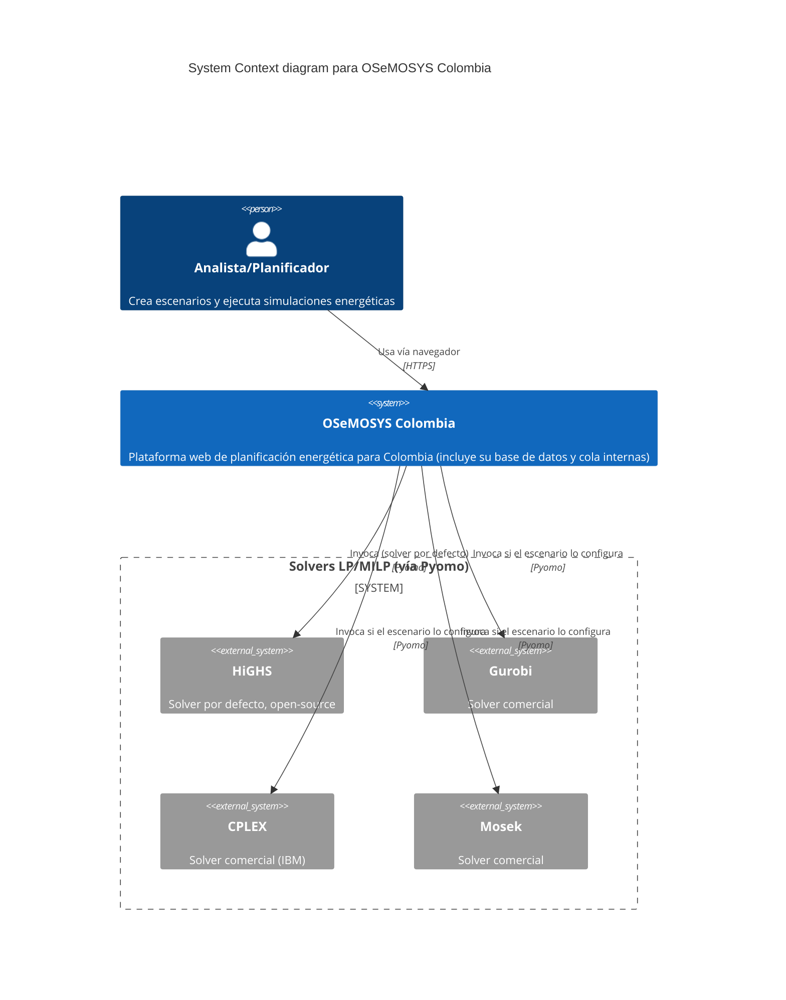

# Visión general (C4)

Esta página es la referencia arquitectónica del backend OSeMOSYS Colombia. Primero fija las convenciones básicas del proyecto (stack, estructura de carpetas, esquemas de base de datos, autenticación) y luego describe la arquitectura completa con el enfoque **C4** (contexto, contenedores, componentes), el mapa de módulos del motor de simulación, los flujos operacionales críticos y el contrato de resultados.

## Convenciones

### Stack

El stack usa FastAPI como API, PostgreSQL como base de datos, SQLAlchemy 2.x en modo síncrono junto con `psycopg` como ORM, Alembic para las migraciones, JWT (HS256) para la autenticación, y Redis con Celery para la cola y lo asíncrono. Los solvers disponibles son HiGHS (`appsi_highs`, por defecto), Gurobi, CPLEX y Mosek, todos vía Pyomo, seleccionables por escenario mediante el catálogo `solver`.

### Estructura de carpetas

| Ruta | Contenido |
|---|---|
| `app/main.py` | factory y app FastAPI |
| `app/core/` | configuración, logging y seguridad |
| `app/db/` | engine, sesión y base declarativa |
| `app/models/` | modelos ORM (`app/models/core/` para el schema `core`, usuarios; `app/models/*` para el schema `osemosys`, modelo principal) |
| `app/schemas/` | schemas Pydantic (request/response) |
| `app/repositories/` | acceso a datos, solo consultas y operaciones sobre la base |
| `app/services/` | reglas de negocio (validaciones, paginación, permisos) |
| `app/api/v1/` | endpoints versionados que solo llaman a services (`app/api/v1/api.py` registra los routers explícitamente) |
| `alembic/` | scripts de migración |
| `scripts/seed.py` | datos de prueba idempotentes |

### Esquemas de PostgreSQL

El esquema `osemosys` agrupa las tablas del dominio del modelo (`scenario`, `parameter_value`, etc.) y el esquema `core` agrupa las tablas transversales, por ejemplo `user`.

!!! note "Migraciones multi-schema"
    `alembic/env.py` configura `include_schemas=True` para soportar múltiples schemas. Las migraciones crean los schemas explícitamente (`CREATE SCHEMA IF NOT EXISTS ...`).

### Autenticación

El login se hace con `POST /api/v1/auth/login` (form-data `username`, `password`). El JWT lleva el claim `sub` igual a `user_id` (**UUID** serializado a string). Y la autorización va en el header `Authorization: Bearer <token>`.

### Respuesta estándar para listados

Los endpoints de listado retornan un sobre (*envelope*) con dos claves. `data` trae la lista de items y `meta` trae los metadatos de paginación.

!!! warning "Convención de paginación"
    `offset` es el número de página (**empieza en 1**, no es un desplazamiento en filas) y `cantidad` es el tamaño de página. No hay que asumir la semántica habitual de `offset` como número de fila inicial.

## Vista de contexto (C4, System Context)

El sistema backend OSeMOSYS se integra con los **usuarios técnicos y analistas** que gestionan escenarios y ejecutan simulaciones, con el **frontend web** que consume la API REST para escenarios, jobs, progreso y resultados (ver [Frontend](frontend.md)), y con los **solvers LP/MILP** (HiGHS, Gurobi, CPLEX, Mosek, vía Pyomo) que resuelven el problema matemático.

!!! note "PostgreSQL y Redis no aparecen como sistemas externos"
    A este nivel de zoom (Contexto), PostgreSQL y Redis son infraestructura **interna** de OSeMOSYS Colombia (se despliegan juntos en el mismo stack) y quedan implícitos dentro de la caja del sistema. Aparecen como contenedores propios recién en la vista de Contenedores, más abajo.

## Vista de contenedores (C4, Container)

Los contenedores lógicos son estos. La **API FastAPI** recibe las peticiones HTTP, contiene la capa de aplicación (routers, services, repositories) y publica los endpoints de negocio y simulación. El **worker Celery** consume los jobs de Redis, ejecuta el pipeline de simulación y escribe los artefactos. **PostgreSQL** guarda, en los schemas `core` y `osemosys`, la persistencia transaccional de catálogo, escenarios, parámetros, jobs y eventos. Y **Redis** actúa como broker y backend de Celery.

Este es el flujo de alto nivel.

1. `POST /simulations` crea un `simulation_job` en estado `QUEUED`.
2. El worker toma el job y lo hace avanzar `RUNNING` → `SUCCEEDED`/`FAILED`/`CANCELLED`.
3. La API expone estado, logs y resultados (`/result`).

## Vista de componentes (C4, Component)

### API Layer

| Archivo | Rol |
|---|---|
| `app/main.py` | app factory, CORS y registro de routers |
| `app/api/v1/api.py` | composición de endpoints v1 |
| `app/api/v1/simulations.py` | endpoint de submit, status, list, cancel, logs y result |

### Application/Domain Layer

`app/services/simulation_service.py` controla los permisos por escenario, el límite de jobs activos por usuario, la traducción de entidades al contrato público y la resolución del artefacto final.

### Data Access Layer

`app/repositories/simulation_repository.py` hace el CRUD de jobs y eventos, calcula `queue_position` y cuenta los jobs activos.

### Simulation Engine Layer

| Archivo | Rol |
|---|---|
| `app/simulation/celery_app.py` | inicialización de Celery |
| `app/simulation/tasks.py` | task principal del job |
| `app/simulation/pipeline.py` | orquestación por etapas, cancelación cooperativa y artefactos |
| `app/simulation/osemosys_core.py` | fachada basada en la base de datos |
| `app/simulation/core/*` | bloques matemáticos de Pyomo |

El detalle completo de la formulación matemática, el solver y el procesamiento de resultados vive en [Motor de simulación OSeMOSYS](motor-osemosys.md).

<!--
## Mapa de módulos del motor OSeMOSYS

### Ingesta y normalización

`core/parameters_loader.py` lee `parameter_value` y `osemosys_param_value`, normaliza los nombres de parámetros y construye `DemandRow`, `SupplyRow` y los mapas de parámetros.

### Construcción de contexto

`core/sets_and_indices.py` genera los índices de demanda, oferta y tecnología, y construye el `ModelContext`.

### Modelo matemático

| Archivo | Contenido |
|---|---|
| `core/variables.py` | variables principales (`dispatch`, `unmet`, `new_capacity`) y auxiliares |
| `core/constraints_core.py` | balance, capacidad, límites de inversión y capacidad |
| `core/constraints_emissions.py` | emisiones agregadas y límite anual |
| `core/constraints_reserve_re.py` | reserve margin y RE target con variables de gap |
| `core/constraints_storage.py` | bloque storage (proxy actual) |
| `core/constraints_udc.py` | bloque UDC (proxy actual) |
| `core/objective.py` | función objetivo de costo total con penalizaciones |
| `core/model_runner.py` | ensambla el modelo, ejecuta el solver y extrae resultados |

Ver [Motor de simulación OSeMOSYS](motor-osemosys.md) para la formulación matemática completa (sets, parámetros, variables, objetivo, restricciones, solver y rendimiento).

## Flujos operacionales críticos

### Submit de simulación

1. La API valida el acceso al escenario.
2. Verifica el límite por usuario (`SIM_USER_ACTIVE_LIMIT`).
3. Crea el job y encola la task de Celery.
4. Registra un evento inicial en `simulation_job_event`.

### Ejecución del worker

1. La task marca el job en `RUNNING`.
2. El pipeline ejecuta las etapas `extract_data`, `build_model`, `solve` y `persist_results`.
3. Persiste el artefacto JSON y `result_ref`.
4. Marca el job en su estado final y registra el evento terminal.

### Cancelación cooperativa

`cancel_requested` se evalúa entre etapas y subetapas. Si se activa, el job finaliza en `CANCELLED` sin continuar con el solve ni la persistencia.

## Contrato de resultados

El artefacto estándar (`/result`) incluye los **KPI principales** (`objective_value`, `coverage_ratio`, `total_demand`, `total_dispatch`, `total_unmet`), las **series** (`dispatch`, `unmet_demand`, `new_capacity`, `annual_emissions`) y los **metadatos** (`stage_times`, `model_timings`, `solver_status`).

## Decisiones arquitectónicas relevantes

Entre las decisiones arquitectónicas relevantes está trabajar con la base de datos como fuente primaria, lo que evita archivos CSV o Excel en runtime y centraliza la gobernanza de datos. También ser asíncrono por cola, lo que desacopla la latencia del solve del request HTTP. Organizar el modelo en bloques, lo que facilita la extensión gradual y la revisión de la formulación. Y usar un artefacto JSON, que da trazabilidad y permite el consumo directo por el frontend.

## Riesgos técnicos actuales

Entre los riesgos técnicos actuales, storage y UDC siguen en implementación proxy, sin la formulación completa canónica. La carga de parámetros depende de que `param_name` mantenga calidad semántica. El tuning del solver está limitado a los valores por defecto. Y el escalamiento queda sujeto a la capacidad de CPU y RAM del host on-prem.

## Guía de cambio seguro

Antes de modificar restricciones u objetivo

1. Crear una rama de trabajo.
2. Cambiar únicamente el bloque objetivo (`core/constraints_*.py` o `core/objective.py`).
3. Ejecutar las validaciones, entre ellas la compilación del backend, la corrida de benchmark y `scripts/validate_simulation_parity.py`.
4. Documentar el impacto en factibilidad, función objetivo y tiempos de solve.

## Roadmap de arquitectura

El roadmap de arquitectura contempla separar el motor de optimización en un microservicio dedicado, incorporar telemetría de rendimiento por bloque y por tamaño de instancia, parametrizar el solver por escenario (tiempo límite, tolerancias, estrategia), completar la paridad matemática de los bloques storage y UDC, e incorporar validaciones semánticas fuertes para la ingesta de parámetros.
-->
