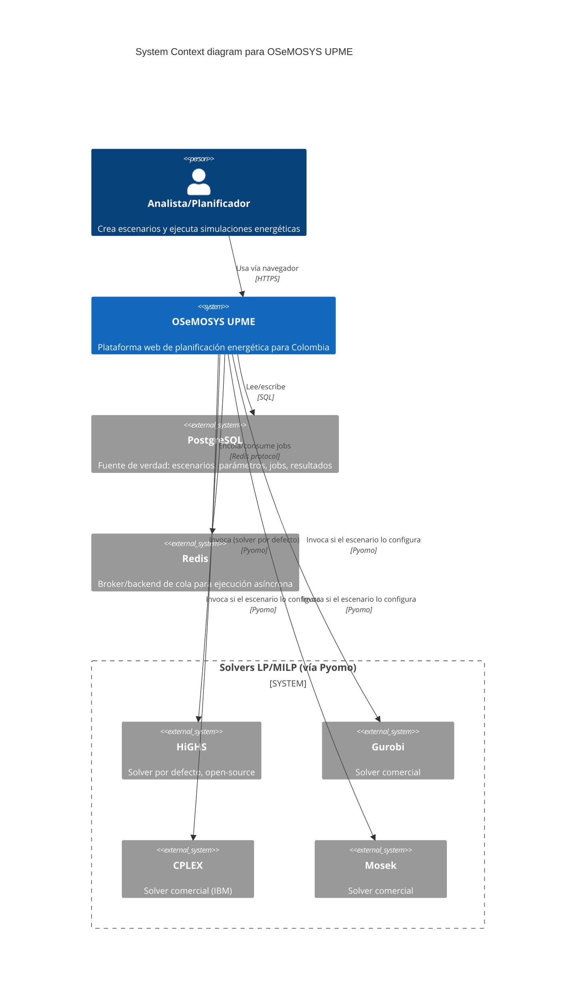
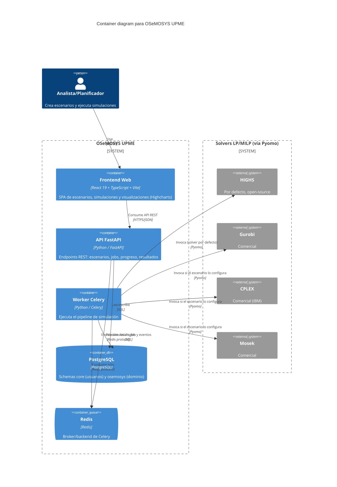
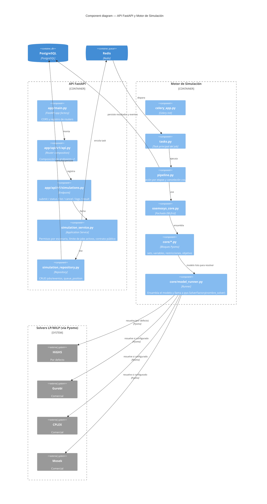

# Visión general (C4)

Esta página es la referencia arquitectónica del backend OSeMOSYS UPME: primero fija las convenciones básicas del proyecto (stack, estructura de carpetas, esquemas de base de datos, autenticación) y luego describe la arquitectura completa con el enfoque **C4** (contexto, contenedores, componentes), el mapa de módulos del motor de simulación, los flujos operacionales críticos y el contrato de resultados.

## Convenciones

### Stack

- **API**: FastAPI
- **Base de datos**: PostgreSQL
- **ORM**: SQLAlchemy 2.x (síncrono) + `psycopg`
- **Migraciones**: Alembic
- **Autenticación**: JWT (HS256)
- **Cola/asíncrono**: Redis + Celery
- **Solvers**: HiGHS (`appsi_highs`, por defecto), Gurobi, CPLEX y Mosek vía Pyomo — seleccionables por escenario mediante el catálogo `solver`

### Estructura de carpetas

- `app/main.py`: factory y app FastAPI.
- `app/core/`: configuración, logging y seguridad.
- `app/db/`: engine, sesión y base declarativa.
- `app/models/`: modelos ORM.
  - `app/models/core/`: schema `core` (usuarios).
  - `app/models/*`: schema `osemosys` (modelo principal).
- `app/schemas/`: schemas Pydantic (request/response).
- `app/repositories/`: acceso a datos (solo consultas/operaciones DB).
- `app/services/`: reglas de negocio (validaciones, paginación, permisos).
- `app/api/v1/`: endpoints versionados (solo llaman a services).
  - `app/api/v1/api.py`: registro explícito de routers.
- `alembic/`: scripts de migración.
- `scripts/seed.py`: datos de prueba idempotentes.

### Esquemas de PostgreSQL

- `osemosys`: tablas del dominio del modelo (`scenario`, `parameter_value`, etc.).
- `core`: tablas transversales (por ejemplo `user`).

!!! note "Migraciones multi-schema"
    `alembic/env.py` configura `include_schemas=True` para soportar múltiples schemas. Las migraciones crean los schemas explícitamente (`CREATE SCHEMA IF NOT EXISTS ...`).

### Autenticación

- Login: `POST /api/v1/auth/login` (form-data `username`, `password`).
- JWT con claim `sub` = `user_id` (**UUID** serializado a string).
- Autorización: header `Authorization: Bearer <token>`.

### Respuesta estándar para listados

Los endpoints de listado retornan un sobre (*envelope*) con dos claves:

- `data`: lista de items.
- `meta`: metadatos de paginación.

!!! warning "Convención de paginación"
    `offset` es el número de página (**1-based**, no un desplazamiento en filas) y `cantidad` es el tamaño de página. No asumir la semántica habitual de `offset` como número de fila inicial.

---

## Vista de contexto (C4 — System Context)

El sistema backend OSeMOSYS se integra con:

- **Usuarios técnicos/analistas** que gestionan escenarios y ejecutan simulaciones.
- **Frontend web** que consume la API REST para escenarios, jobs, progreso y resultados (ver [Frontend](frontend.md)).
- **PostgreSQL** como fuente de verdad de insumos/modelo y estado de ejecución.
- **Redis + Celery** para cola y ejecución asíncrona de optimizaciones.
- **Solvers LP/MILP** (HiGHS, Gurobi, CPLEX, Mosek — vía Pyomo) para resolver el problema matemático.

## Vista de contenedores (C4 — Container)

Contenedores lógicos:

- **API FastAPI**
  - Entrada HTTP.
  - Capa de aplicación (routers, services, repositories).
  - Publica endpoints de negocio y simulación.
- **Worker Celery**
  - Consume jobs de Redis.
  - Ejecuta el pipeline de simulación y escribe artefactos.
- **PostgreSQL**
  - Schemas `core` y `osemosys`.
  - Persistencia transaccional de catálogo, escenarios, parámetros, jobs y eventos.
- **Redis**
  - Broker/backend de Celery.

Flujo de alto nivel:

1. `POST /simulations` crea un `simulation_job` en estado `QUEUED`.
2. El worker toma el job y lo hace avanzar `RUNNING` → `SUCCEEDED`/`FAILED`/`CANCELLED`.
3. La API expone estado, logs y resultados (`/result`).

## Vista de componentes (C4 — Component)

### API Layer

- `app/main.py`: app factory + CORS + registro de routers.
- `app/api/v1/api.py`: composición de endpoints v1.
- `app/api/v1/simulations.py`: endpoint de submit/status/list/cancel/logs/result.

### Application/Domain Layer

- `app/services/simulation_service.py`
  - Permisos por escenario.
  - Límite de jobs activos por usuario.
  - Traducción de entidades a contrato público.
  - Resolución de artefacto final.

### Data Access Layer

- `app/repositories/simulation_repository.py`
  - CRUD de jobs/eventos.
  - `queue_position`.
  - Conteos de jobs activos.

### Simulation Engine Layer

- `app/simulation/celery_app.py`: inicialización Celery.
- `app/simulation/tasks.py`: task principal del job.
- `app/simulation/pipeline.py`: orquestación por etapas, cancelación cooperativa y artefactos.
- `app/simulation/osemosys_core.py`: fachada DB-first.
- `app/simulation/core/*`: bloques matemáticos Pyomo.

El detalle completo de la formulación matemática, el solver y el procesamiento de resultados vive en [Motor de simulación OSeMOSYS](motor-osemosys.md); esta página se limita al mapa de módulos.

## Mapa de módulos del motor OSeMOSYS

### Ingesta y normalización

- `core/parameters_loader.py`
  - Lee `parameter_value` + `osemosys_param_value`.
  - Normaliza nombres de parámetros.
  - Construye `DemandRow`, `SupplyRow` y mapas de parámetros.

### Construcción de contexto

- `core/sets_and_indices.py`
  - Genera índices de demanda/oferta/tecnología.
  - Construye `ModelContext`.

### Modelo matemático

- `core/variables.py`: variables principales (`dispatch`, `unmet`, `new_capacity`) y auxiliares.
- `core/constraints_core.py`: balance, capacidad, límites de inversión/capacidad.
- `core/constraints_emissions.py`: emisiones agregadas y límite anual.
- `core/constraints_reserve_re.py`: reserve margin + RE target con variables de gap.
- `core/constraints_storage.py`: bloque storage (proxy actual).
- `core/constraints_udc.py`: bloque UDC (proxy actual).
- `core/objective.py`: función objetivo de costo total con penalizaciones.
- `core/model_runner.py`: ensambla el modelo, ejecuta el solver y extrae resultados.

Ver [Motor de simulación OSeMOSYS](motor-osemosys.md) para la formulación matemática completa (sets, parámetros, variables, objetivo, restricciones, solver y rendimiento).

---

## Flujos operacionales críticos

### Submit de simulación

1. La API valida el acceso al escenario.
2. Verifica el límite por usuario (`SIM_USER_ACTIVE_LIMIT`).
3. Crea el job y encola la task de Celery.
4. Registra un evento inicial en `simulation_job_event`.

### Ejecución del worker

1. La task marca el job en `RUNNING`.
2. El pipeline ejecuta etapas:
   - `extract_data`
   - `build_model`
   - `solve`
   - `persist_results`
3. Persiste el artefacto JSON y `result_ref`.
4. Marca el job en su estado final y registra el evento terminal.

### Cancelación cooperativa

- `cancel_requested` se evalúa entre etapas y sub-etapas.
- Si se activa, el job finaliza en `CANCELLED` sin continuar el solve/persistencia.

## Contrato de resultados

El artefacto estándar (`/result`) incluye:

- **KPI principales**: `objective_value`, `coverage_ratio`, `total_demand`, `total_dispatch`, `total_unmet`.
- **Series**: `dispatch`, `unmet_demand`, `new_capacity`, `annual_emissions`.
- **Metadatos**: `stage_times`, `model_timings`, `solver_status`.

## Decisiones arquitectónicas relevantes

- **DB-first**: evita archivos CSV/Excel en runtime y centraliza gobernanza de datos.
- **Asíncrono por cola**: desacopla la latencia del solve del request HTTP.
- **Bloques de modelo**: facilita la extensión gradual y la revisión de la formulación.
- **Artefacto JSON**: trazabilidad y consumo directo por el frontend.

## Riesgos técnicos actuales

- Storage/UDC en implementación proxy (no formulación completa canónica).
- Dependencia de la calidad semántica de `param_name` para la carga de parámetros.
- Tuning del solver limitado a los valores por defecto.
- Escalamiento sujeto a la capacidad de CPU/RAM del host on-prem.

## Guía de cambio seguro

Antes de modificar restricciones/objetivo:

1. Crear una rama de trabajo.
2. Cambiar únicamente el bloque objetivo (`core/constraints_*.py` o `core/objective.py`).
3. Ejecutar validaciones:
   - compilación del backend;
   - corrida de benchmark;
   - `scripts/validate_simulation_parity.py`.
4. Documentar el impacto en:
   - factibilidad;
   - función objetivo;
   - tiempos de solve.

## Roadmap de arquitectura

- Separar el motor de optimización a un microservicio dedicado.
- Incorporar telemetría de rendimiento por bloque y por tamaño de instancia.
- Parametrizar el solver por escenario (tiempo límite, tolerancias, estrategia).
- Completar la paridad matemática de los bloques storage y UDC.
- Incorporar validaciones semánticas fuertes para la ingesta de parámetros.
