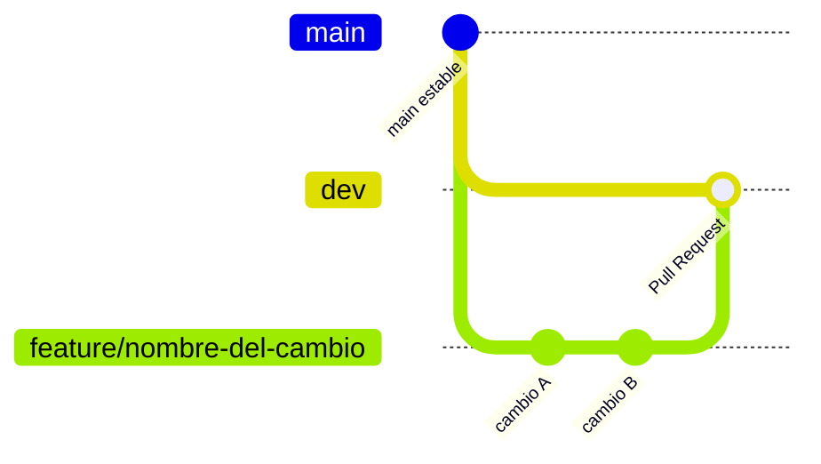

# Contribuir

Esta página resume cómo preparar un entorno de desarrollo para la aplicación OSeMOSYS Colombia, cómo correr sus pruebas y linters, y cómo editar y previsualizar esta misma documentación.

## Entorno de desarrollo de la aplicación

Para levantar la aplicación en primer lugar, sigue [Instalación](getting-started/installation.md) (Docker o modo local con SQLite).

### Backend

```bash
cd backend
pytest                                        # toda la suite de pruebas
pytest tests/test_visualization_configs.py    # un solo archivo
```

### Frontend

```bash
cd frontend
npm run typecheck   # verificación de tipos (tsc --noEmit)
npm run lint        # eslint
```

!!! tip "Antes de proponer un cambio"
    Corre `pytest` en el backend y `npm run typecheck` más `npm run lint` en el frontend antes de abrir un cambio. Son las mismas verificaciones que se esperan en revisión.

## Flujo de contribución (ramas y Pull Requests)

Los cambios a la aplicación se proponen mediante ramas de feature y Pull Requests, no con push directo a `main` ni a `dev`.

1. Crea una rama nueva a partir de `main`, con un nombre que describa el cambio, por ejemplo `feature/nombre-del-cambio` o `fix/nombre-del-bug`.
2. Haz los cambios y corre las pruebas correspondientes, `pytest` en el backend y `npm run typecheck` más `npm run lint` en el frontend, como se describió arriba.
3. Sube la rama y abre un Pull Request contra la rama `dev` del repositorio [UPME-SubDemanda/Osemosys_UPME](https://github.com/UPME-SubDemanda/Osemosys_UPME).
4. Describe el cambio y su motivación en el PR, y espera la revisión y el resultado de CI antes de fusionar.

