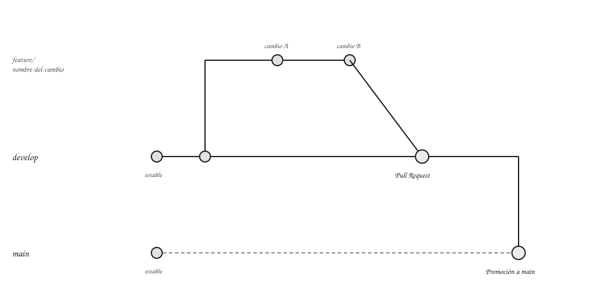

# Contribuir

OSeMOSYS Colombia vive en dos repositorios independientes: la aplicación ([UPME-SubDemanda/Osemosys_UPME](https://github.com/UPME-SubDemanda/Osemosys_UPME)) y este sitio de documentación. Esta página cubre cómo contribuir a los dos: cómo proponer un cambio de código a la aplicación, y cómo editar o ampliar esta documentación.

## Antes de abrir un cambio

Para un cambio pequeño o una corrección puntual, se puede ir directo a abrir un Pull Request. Para algo más grande (una funcionalidad nueva, un cambio de comportamiento, una refactorización amplia), conviene abrir primero un [Issue](https://github.com/UPME-SubDemanda/Osemosys_UPME/issues) describiendo el problema o la propuesta, para alinear el alcance antes de invertir tiempo en la implementación. Ver también [Soporte](support.md) para dudas o errores como usuario, no cambios de código.

## Código de la aplicación

### Entorno de desarrollo

Para tener el stack corriendo localmente, ver [Instalación](getting-started/installation.md) (con `task` o con Docker Compose directo).

### Flujo de ramas y Pull Requests

Los cambios se proponen mediante ramas de feature y Pull Requests, no con push directo a `develop` ni a `main`.

1. Crear una rama nueva a partir de `develop`, con un nombre que describa el cambio, por ejemplo `feature/nombre-del-cambio` o `fix/nombre-del-bug`.
2. Hacer los cambios y correr las verificaciones de estilo y pruebas descritas abajo.
3. Subir la rama y abrir un Pull Request contra `develop` en [UPME-SubDemanda/Osemosys_UPME](https://github.com/UPME-SubDemanda/Osemosys_UPME).
4. Describir el cambio y su motivación en el PR, y esperar la revisión y el resultado de CI antes de fusionar.



!!! note "Por qué el Pull Request va contra `develop` y no contra `main`"
    Un workflow de GitHub Actions (`main-source-policy.yml`) rechaza automáticamente cualquier Pull Request hacia `main` que no venga de `develop`. La promoción de `develop` a `main` es un paso aparte, posterior a que el cambio ya esté integrado y probado en `develop`, y no algo que un colaborador individual necesite hacer.

### Estilo y pruebas

**Backend** (FastAPI + pytest, más de 40 archivos de prueba en `backend/tests/`):

```bash
docker compose run --rm api python -m pytest -q      # misma forma en que corre en CI, contra Postgres y Redis reales
pytest                                                # alternativa si tienes un entorno Python local con las dependencias instaladas
pytest tests/test_visualization_configs.py            # un solo archivo
```

**Frontend** (React + Vite + TypeScript):

```bash
cd frontend
npm run typecheck    # verificación de tipos (tsc --noEmit)
npm run lint         # eslint
npm run format       # prettier ("format:check" solo verifica, sin escribir)
```

!!! note "Qué corre realmente en CI"
    El pipeline (`ci-cd.yml`) ejecuta `npm run typecheck` y `npm run build` en el frontend, y la suite de `pytest` del backend contra contenedores reales de PostgreSQL y Redis, no mockeados. `npm run lint` y `npm run format` todavía no son parte del pipeline, pero se recomienda correrlos antes de abrir el PR: son las mismas verificaciones que se esperan en revisión.

### Qué verifica el pipeline de CI

Cada Pull Request y cada push a `develop` o `main` dispara un pipeline que, en orden:

1. Valida la configuración de `docker-compose.yml`.
2. Instala las dependencias del frontend y corre `typecheck` y `build`.
3. Levanta PostgreSQL y Redis reales, y corre la suite de `pytest` del backend contra ellos.
4. Despliega el stack completo localmente y corre *smoke checks*: los endpoints de salud de la API y el frontend, y un ping al worker de Celery.

Un cambio que pasa en el entorno local pero rompe el despliegue o los *smoke checks* del paso 4 sí bloqueará el Pull Request — vale la pena tenerlos en cuenta si el cambio toca configuración de servicios, variables de entorno o el worker de simulación.

## Documentación (este sitio)

Este sitio (MkDocs + Material) vive en su propio repositorio, separado del de la aplicación. Para editarlo o ampliarlo:

```bash
docker compose up
```

Queda disponible en [http://localhost:8001](http://localhost:8001), con recarga automática al editar cualquier archivo en `docs/` o `mkdocs.yml`. Antes de abrir el Pull Request, conviene correr un build estricto para detectar enlaces internos rotos (el mismo que se corre antes de publicar):

```bash
docker compose exec docs mkdocs build --strict
```

## Contribuciones asistidas por IA

Parte de esta documentación se ha escrito con asistencia de IA. Al proponer un cambio (de código o de documentación) generado o asistido por IA, se espera lo siguiente:

- El resultado debe quedar redactado de forma clara y legible para un humano, no como una transcripción sin editar de lo que produjo la herramienta.
- Quien propone el cambio es responsable de su corrección y calidad, se haya escrito con ayuda de IA o no — revisarlo como si se hubiera escrito a mano antes de subirlo.
- Preferir cambios simples y acotados sobre abstracciones o reescrituras amplias que nadie pidió.
- Para cambios grandes generados con IA, coordinar antes con el equipo (ver [antes de abrir un cambio](#antes-de-abrir-un-cambio) arriba) — son más costosos de revisar que un cambio escrito a mano de tamaño equivalente.
- Si una afirmación no se pudo verificar contra el código o el comportamiento real de la aplicación, decirlo explícitamente en vez de presentarla como un hecho — así están marcados los puntos "por confirmar" en [Funcionalidades](features.md) y [Soporte](support.md).
