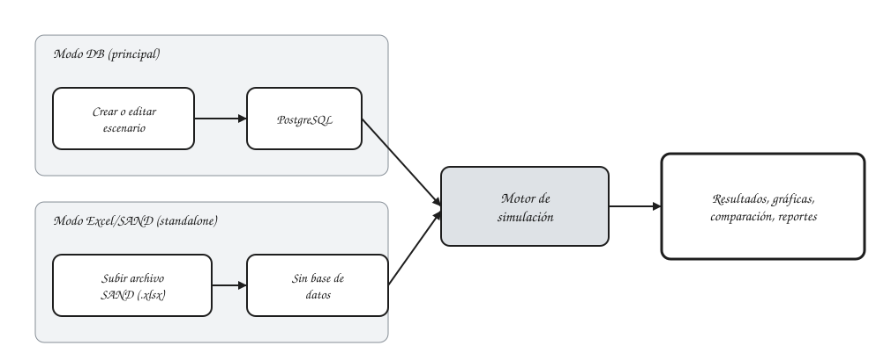

# Ejemplos

Esta sección parte de la aplicación ya en uso: primero, cómo se alimenta de datos, y luego un recorrido de ejemplos concretos, desde el primer flujo de punta a punta hasta un caso con datos reales de política energética colombiana.

## Dos modos de trabajo

| Modo | Cómo funciona | Cuándo usarlo |
|------|----------------|----------------|
| **Escenarios en base de datos (modo DB)** | Los datos de entrada (demanda, tecnologías, combustibles, restricciones) viven en la base de datos PostgreSQL de la aplicación, organizados como escenarios reutilizables. | Es el modo principal, para construir, versionar y comparar múltiples escenarios de forma controlada dentro de la plataforma. |
| **Carga de Excel/SAND** | Se sube un archivo Excel con el formato SAND y la simulación corre directamente sobre esos datos, sin pasar por la base de datos. | Para pruebas rápidas, validaciones puntuales, o para reproducir/comparar una corrida hecha originalmente en una hoja de cálculo externa (por ejemplo, un archivo SAND). |

Ambos modos alimentan el mismo motor de simulación y producen resultados visualizables de la misma manera. Ver [Escenarios y catálogos](../user-guide/escenarios.md) y [Carga de datos Excel/SAND](../user-guide/carga-excel-sand.md) respectivamente.

## Explorar los ejemplos

-   :material-play-circle-outline:{ .lg .middle } **Primera simulación**

    ---
    Recorrido completo, paso a paso: iniciar sesión, crear un escenario, lanzar la simulación y comparar resultados.

    [:octicons-arrow-right-24: Ver tutorial](first-simulation.md)

-   :material-file-table-outline:{ .lg .middle } **Archivos SAND**

    ---
    Formato de referencia para cargar catálogos y escenarios completos desde Excel.

    [:octicons-arrow-right-24: Ver ejemplo](sand-files.md)

-   :material-chart-line:{ .lg .middle } **Evolución de la matriz eléctrica**

    ---
    Caso con datos reales: cómo cambia la matriz eléctrica colombiana entre tres escenarios de política energética (PEN).

    [:octicons-arrow-right-24: Ver ejemplo](matriz-electrica-escenarios.md)

