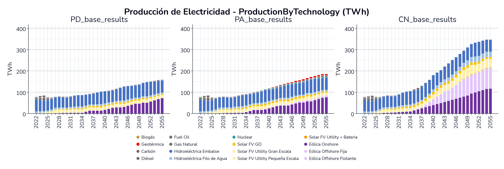
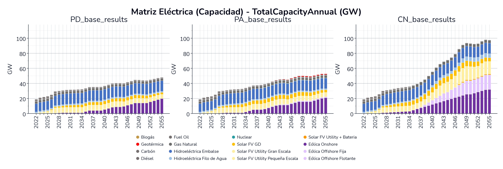
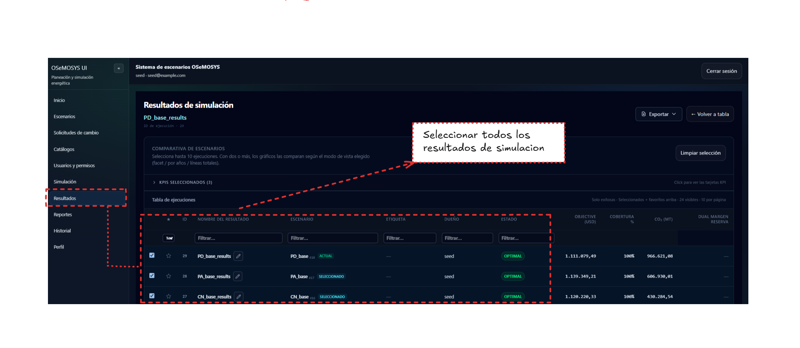

# Evolución de la matriz eléctrica

Este ejemplo compara los resultados de tres escenarios de largo plazo (2022 a 2055) para entender cómo cambia la matriz eléctrica colombiana según la política energética que se asuma.

## Resultados de planeacion : Oferta de electricidad

Las tres gráficas comparten la misma escala (0 a 400 TWh), lo que permite ver de un vistazo la diferencia de magnitud. En **PD**, la producción crece de forma moderada, terminando 2055 alrededor de 160 TWh, con la hidroeléctrica de embalse como base y la eólica onshore (la barra morada) como la principal fuente nueva. **PA** sigue un patrón parecido pero termina algo más arriba, cerca de 185 TWh, y hacia el final del horizonte aparece un aporte pequeño de geotérmica.

**CN** es donde el panorama cambia de forma cualitativa, no solo de magnitud. La producción total llega a rondar 345 TWh en 2055, más del doble que PD. Ese salto no se explica solo por más de lo mismo, sino porque aparece la eólica offshore (fija y flotante, los tonos lila claro) como una fuente relevante desde mediados de la década de 2030, algo que prácticamente no existe en PD ni en PA.

## Capacidad instalada sector eléctrico

El patrón de capacidad instalada (en GW) confirma la misma historia, pero de forma más marcada todavía. PD llega a unos 48 GW instalados en 2055 y PA a unos 52 GW, mientras que CN se acerca a 95 GW, casi el doble. La capacidad crece más rápido que la energía producida en el escenario CN porque las renovables intermitentes (eólica y solar) necesitan más capacidad instalada por unidad de energía firme entregada que una planta térmica o hidroeléctrica despachable.

## Cómo reproducir esta comparación en la aplicación

1. Ten los tres escenarios ya simulados (en este ejemplo, `PD_base_results`, `PA_base_results` y `CN_base_results`).
2. Ve a la sección **Resultados** del menú lateral. En la tabla de ejecuciones, marca la casilla de cada resultado que quieras comparar, hasta 10 a la vez. En este ejemplo se marcan `PD_base_results`, `PA_base_results` y `CN_base_results`.

    

    Con dos o más resultados marcados, la aplicación habilita la comparativa de escenarios y arma las gráficas según el modo de vista que elijas después (facetas, por año o líneas totales).
3. Usa el modo **Facetas**, que pone una gráfica completa por escenario, una junto a otra, como en las imágenes de arriba.
4. Para la primera gráfica, elige la variable de producción (`ProductionByTechnology`) agrupada por **tecnología**. Para la segunda, elige capacidad (`TotalCapacityAnnual`), también agrupada por tecnología.

Ver el detalle completo de modos de comparación y tipos de vista en [Visualizaciones y reportes](../user-guide/visualizaciones.md#comparacion-entre-escenarios).
