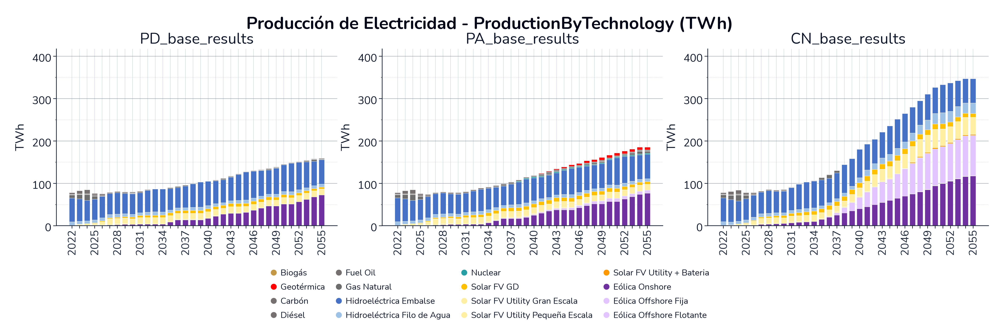
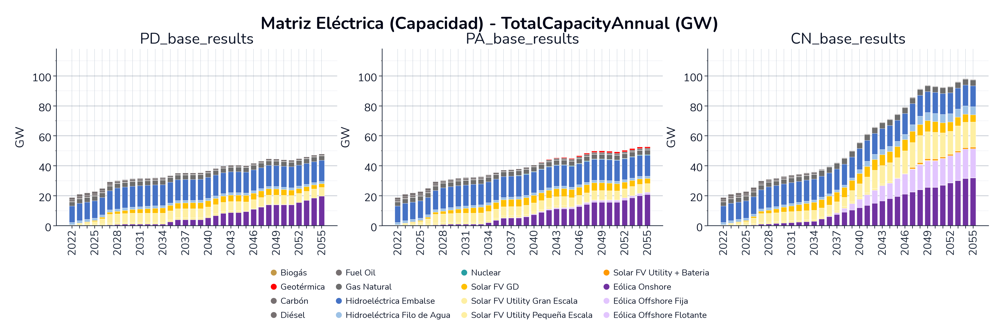

# Evolución de la matriz eléctrica

Este ejemplo compara los resultados de tres escenarios de largo plazo (2022 a 2055) para entender cómo cambia la matriz eléctrica colombiana según la política energética que se asuma.

!!! info "Resultados oficiales del PEN"
    Estos son los resultados oficiales de oferta, calculada de forma endógena por el modelo para el sector Electricidad — uno de los sectores del Plan Energético Nacional (PEN). Para el detalle completo de la conceptualización de estos escenarios, ver el [Tomo II del PEN 2025-2055](https://docs.upme.gov.co/DemandayEficiencia/Documents/PEN_2025_2055/PEN_Tomo_II-Conceptualizacion_de_escenarios_PEN_2025-2055_VF.pdf).

!!! note "¿Buscas la lógica matemática detrás de esto?"
    Este ejemplo usa datos reales. Para ver, con un caso simplificado de dos tecnologías, cómo el modelo decide en qué invertir y cuánto cuesta una meta de política, ve a [Quickstart 2 — Expansión de capacidad](../getting-started/quickstart-2-expansion-capacidad.md) y [Quickstart 3 — Restricciones de política](../getting-started/quickstart-3-restricciones-politica.md).

## Resultados de planeacion : Oferta de electricidad

Las tres gráficas comparten la misma escala (0 a 400 TWh), lo que permite ver de un vistazo la diferencia de magnitud. En **PD**, la producción crece de forma moderada, terminando 2055 alrededor de 160 TWh, con la hidroeléctrica de embalse como base y la eólica onshore (la barra morada) como la principal fuente nueva. **PA** sigue un patrón parecido pero termina algo más arriba, cerca de 185 TWh, y hacia el final del horizonte aparece un aporte pequeño de geotérmica.

**CN** es donde el panorama cambia de forma cualitativa, no solo de magnitud. La producción total llega a rondar 345 TWh en 2055, más del doble que PD. Ese salto no se explica solo por más de lo mismo, sino porque aparece la eólica offshore (fija y flotante, los tonos lila claro) como una fuente relevante desde mediados de la década de 2030, algo que prácticamente no existe en PD ni en PA.

## Capacidad instalada sector eléctrico

El patrón de capacidad instalada (en GW) confirma la misma historia, pero de forma más marcada todavía. PD llega a unos 48 GW instalados en 2055 y PA a unos 52 GW, mientras que CN se acerca a 95 GW, casi el doble. La capacidad crece más rápido que la energía producida en el escenario CN porque las renovables intermitentes (eólica y solar) necesitan más capacidad instalada por unidad de energía firme entregada que una planta térmica o hidroeléctrica despachable.

## Cómo reproducir esta comparación

Con los tres escenarios ya simulados (`PD_base_results`, `PA_base_results` y `CN_base_results`), sigue el paso [Comparar resultados](first-simulation.md#5-comparar-resultados-opcional) del tutorial de Primera simulación: marca los tres en la sección **Resultados**, usa el modo **Facetas**, y grafica producción (`ProductionByTechnology`) y capacidad (`TotalCapacityAnnual`) agrupadas por **tecnología**, como en las imágenes de arriba.
