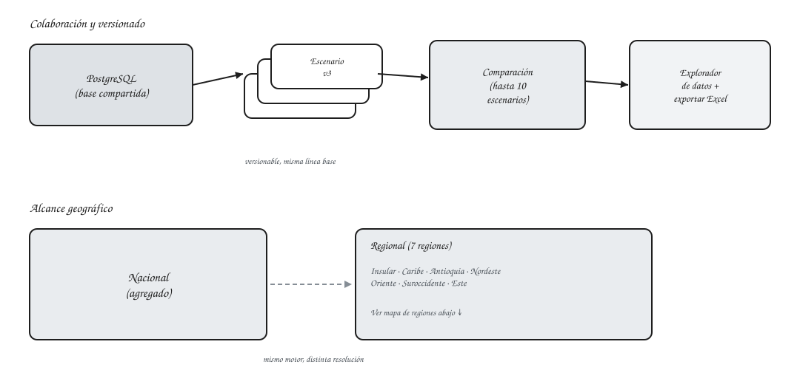
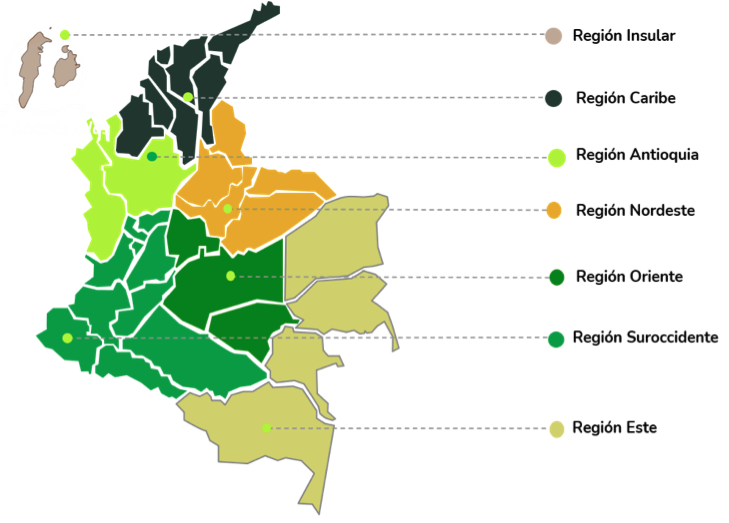
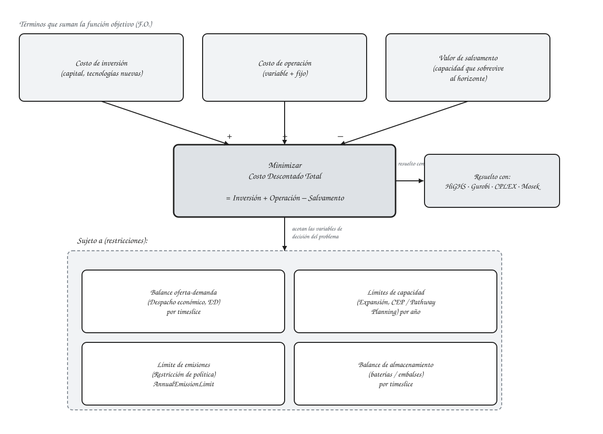
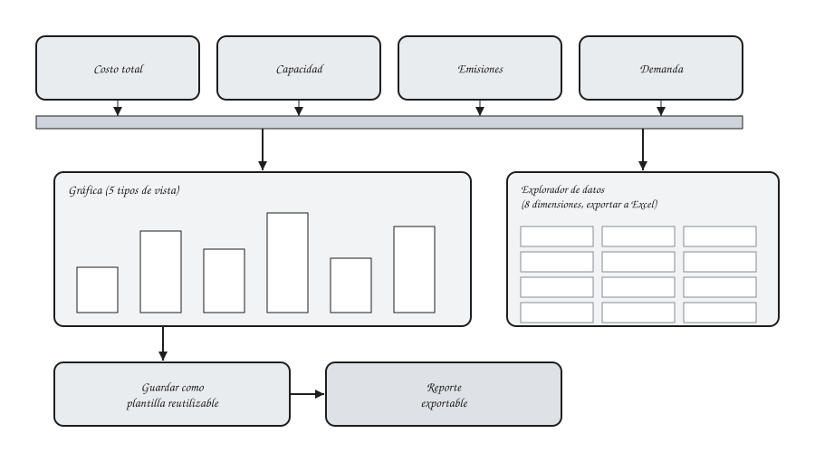
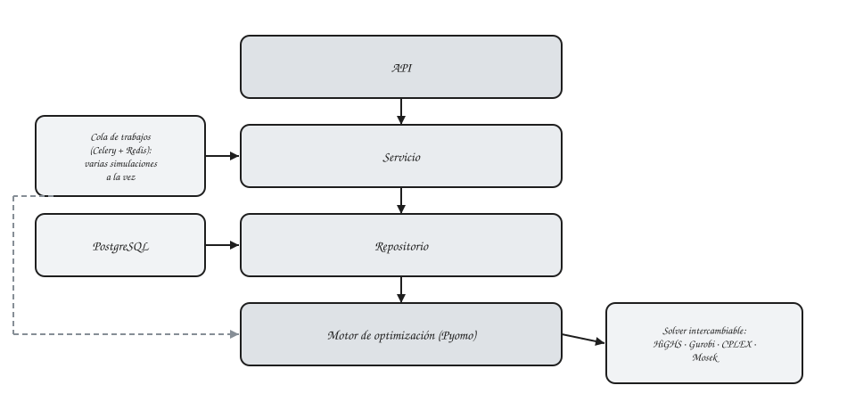

# Funcionalidades

Vista compilada de lo que ofrece OSeMOSYS Colombia, pensada para quien está evaluando la herramienta y no quiere leer las cinco páginas de la Guía de Usuario para reconstruir el panorama completo. Cada punto enlaza a su documentación detallada.

!!! note "Sobre los puntos marcados como \"por confirmar\""
    Algunos puntos abajo dependen de capacidades del motor de optimización que están documentadas a nivel técnico (README del backend) pero que no confirmamos si están expuestas hoy en la interfaz para un analista. Se dejan visibles y marcados explícitamente en vez de omitirlos, para que el equipo de desarrollo los revise antes de anunciarlos sin reservas.

## Generales

Las 7 regiones en las que se desagrega el Sistema Interconectado Nacional en modo regional:

- **Colaborativo**: base de datos compartida (PostgreSQL), escenarios versionables, hasta 10 comparables a la vez. Ver [Escenarios y catálogos](user-guide/escenarios.md).
- **Dos modos de entrada**: escenarios gestionados en base de datos, o simulación directa desde un archivo Excel/SAND sin pasar por la base de datos. Ver [Carga de datos Excel/SAND](user-guide/carga-excel-sand.md).
- **Nacional o regional**: simulaciones a nivel nacional agregado o desagregadas en las 7 regiones del Sistema Interconectado Nacional. Ver [Escenarios y catálogos](user-guide/escenarios.md).
- **Diagnóstico de infactibilidad**: identificación automática de restricciones en conflicto, con análisis detallado bajo demanda. Ver [Resultados infactibles](user-guide/simulaciones.md#resultados-infactibles).
- **Visualización de resultados**: 5 tipos de vista, 4 modos de comparación multiescenario, series sintéticas, plantillas y reportes exportables. Ver [Visualizaciones y reportes](user-guide/visualizaciones.md).
- **Explorador de datos**: tabla de resultados filtrable por 8 dimensiones, con exportación a Excel. Ver [Explorador de datos de resultados](user-guide/visualizaciones.md#explorador-de-datos-de-resultados).

## Optimización

En el fondo, cada simulación es un único problema de optimización: minimizar el costo descontado total sujeto a las restricciones que se listan abajo. Cada una tiene un ejemplo matemático simple (dos tecnologías, con la formulación real de OSeMOSYS, aritmética verificable a mano) en los quickstarts.

- **Despacho económico (ED)**: para cada timeslice, el modelo decide qué tecnologías producen para cubrir la demanda al menor costo total. Ejemplo: [Quickstart 1 — Despacho económico](getting-started/quickstart-1-oferta-demanda.md).
- **Planeación de expansión de capacidad (CEP)** y **planeación de trayectoria multianual (Pathway Planning)**: el modelo decide en qué tecnología invertir, cuándo, y cómo se contabiliza esa inversión (incluido el valor de salvamento) dentro de un horizonte de varios años. Ejemplo: [Quickstart 2 — Expansión de capacidad](getting-started/quickstart-2-expansion-capacidad.md). En la interfaz, con datos reales: [Evolución de la matriz eléctrica](examples/matriz-electrica-escenarios.md).
- **Restricciones de política (Policy Constraints)**: metas de emisiones (`AnnualEmissionLimit`) y límites de capacidad, editables directamente desde un escenario. Ejemplo: [Quickstart 3 — Restricciones de política](getting-started/quickstart-3-restricciones-politica.md).
- **Modelado de almacenamiento**: baterías y embalses, con dimensión propia en el explorador de resultados. Ver [Explorador de datos de resultados](user-guide/visualizaciones.md#explorador-de-datos-de-resultados).
- **Flexibilidad de solver**: HiGHS por defecto (sin costo de licencia) o Gurobi/CPLEX/Mosek, como decisión de configuración, no una reescritura del modelo. Ver [Requisitos y solvers](getting-started/requisitos.md).

!!! question "Por confirmar con el equipo de desarrollo"
    El motor implementa además un bloque de **margen de reserva** (ejemplo: [Quickstart 4 — Margen de reserva](getting-started/quickstart-4-margen-reserva.md)). No confirmamos si un analista puede configurarlo hoy desde la interfaz o si por ahora es solo capacidad interna del motor de optimización.

## Análisis y usabilidad

- **Indicadores clave (KPIs)**: resumen de indicadores al abrir cualquier resultado de simulación. Ver [Visión general](user-guide/overview.md).
- **Visualizaciones**: el punto más fuerte de la plataforma — ver el bloque de [Generales](#generales) arriba.
- **Documentación en español**: contextualizada al sistema energético colombiano, a diferencia de la documentación en inglés del framework OSeMOSYS genérico.

!!! question "Por confirmar"
    - **Precios sombra / costos marginales**: no encontramos evidencia de que la aplicación exponga precios duales de commodities o restricciones para corridas factibles.
    - **Canal de soporte**: ya existe [Soporte](support.md) con el canal de reporte de problemas y las dudas más comunes, pero falta confirmar si hace falta un canal institucional aparte para analistas sin cuenta de GitHub.
    - **Licencia**: no está definido bajo qué licencia se distribuyen la documentación ni el código de la aplicación.

## Arquitectura y rendimiento

- **Separación por capas**: API, servicio, repositorio y motor de optimización como capas independientes — relevante para equipos técnicos que integren o extiendan la plataforma.
- **Control de resolución**: timeslices colapsables a uno solo o discriminados, nacional vs. regional. Ver [Escenarios y catálogos](user-guide/escenarios.md).
- **Motor y persistencia**: Pyomo con solvers intercambiables sobre una base de datos PostgreSQL compartida. Ver [¿Qué es esta plataforma?](getting-started/plataforma.md).
- **Ejecución concurrente**: cola de trabajos (Celery + Redis) para correr varias simulaciones a la vez sin bloquearse entre sí, con guía de dimensionamiento de hardware según el tamaño del escenario. Ver [Requisitos y solvers](getting-started/requisitos.md).
