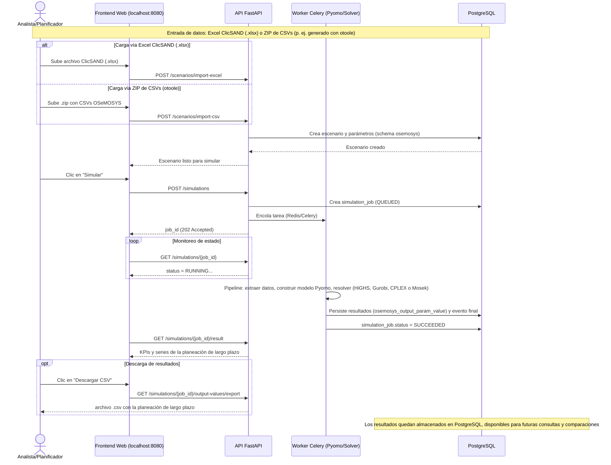
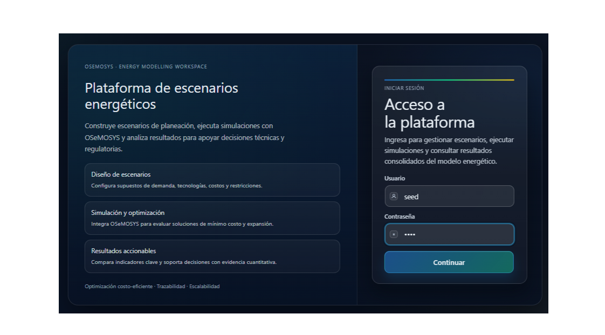
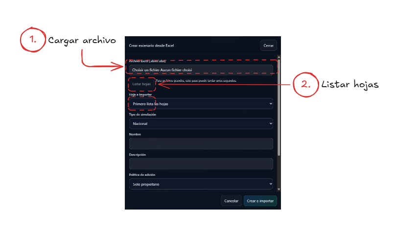
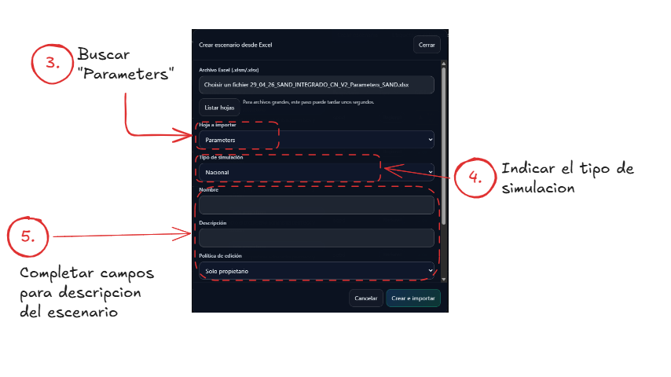
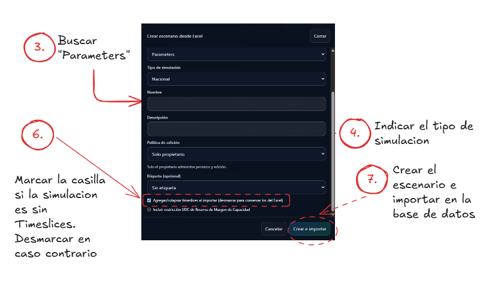
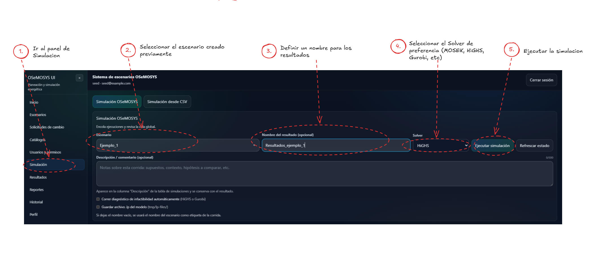
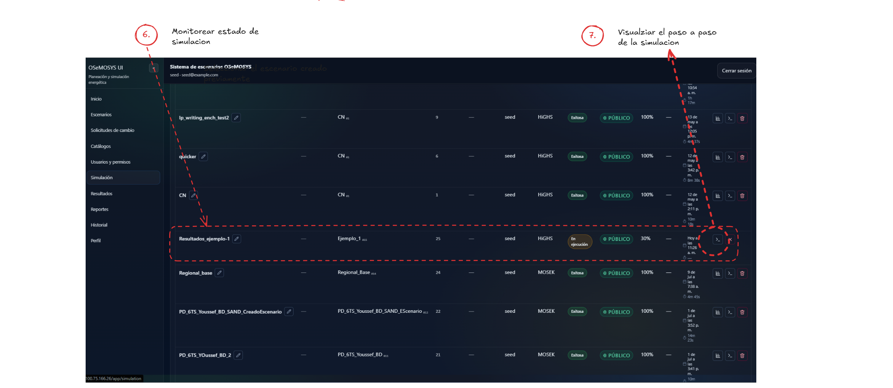
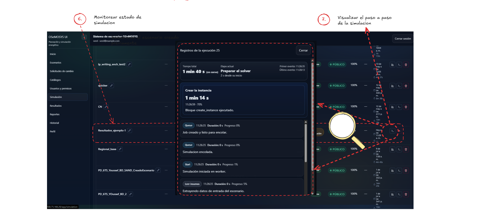

# Primera simulación

Esta guía te lleva paso a paso desde iniciar sesión hasta ver y descargar los primeros resultados de una simulación. Se asume que ya tienes el stack levantado. Si no, sigue primero [Instalación](installation.md).

!!! tip "Antes de empezar"
    Necesitas el usuario semilla creado por `scripts/seed.py`, usuario **`seed`** y contraseña **`seed123`**.

!!! tip "Cómo agregar tus propias capturas de pantalla"
    Cada paso de esta guía tiene un bloque **"📸 Captura pendiente"** con una línea de imagen comentada (`<!--  -->`). Guarda tus capturas en `docs/assets/screenshots/first-simulation/` con el nombre sugerido en cada bloque y descomenta esa línea. No necesitas tocar nada más.

## Diagrama del proceso

Toda simulación arranca con datos de entrada (un archivo Excel **ClicSAND** o un **ZIP de CSVs** OSeMOSYS, por ejemplo generado con `otoole`), pasa por el motor de optimización, y termina en dos salidas, resultados descargables en CSV y resultados persistidos en PostgreSQL.

## 1. Iniciar sesión

Abre el frontend en tu navegador ([http://localhost:8080](http://localhost:8080) si usas el stack Docker por defecto) e inicia sesión con el usuario `seed` y la contraseña `seed123`.

!!! example "📸 Captura pendiente"
    Pantalla de inicio de sesión.

    <!--  -->

## 2. Elegir o crear un escenario

Un **escenario** agrupa el conjunto de datos de entrada (demanda, tecnologías, combustibles, restricciones, etc.) sobre el que se ejecuta una simulación. Dirígete a la sección de escenarios. Si ya existen escenarios de ejemplo (creados por la siembra inicial), selecciona uno de la lista. Si necesitas crear uno nuevo, hay **dos formas de cargar los datos de entrada**.

### 2a. Desde un archivo Excel ClicSAND (`.xlsx`)

Sube el archivo Excel ClicSAND (formato SAND) directamente desde la interfaz. La aplicación lo procesa e importa como un nuevo escenario en la base de datos. Ver el detalle completo en [Carga de datos Excel/SAND](../user-guide/carga-excel-sand.md).

1. Carga el archivo Excel y lista las hojas disponibles.

    

2. Busca la hoja `Parameters`, indica el tipo de simulación (Nacional/Regional) y completa el nombre y la descripción del escenario.

    

3. Marca la casilla de timeslices según corresponda y crea el escenario para importarlo a la base de datos.

    

### 2b. Desde un ZIP de CSVs (por ejemplo, generado con `otoole`)

Si ya tienes el conjunto de datos OSeMOSYS en formato CSV (por ejemplo, exportado con [`otoole`](https://github.com/OSeMOSYS/otoole) u otra herramienta), agrúpalos en un único archivo `.zip` y súbelo desde la interfaz. La aplicación valida los CSV requeridos (`YEAR.csv`, `REGION.csv`, `TECHNOLOGY.csv`, `TIMESLICE.csv`, `MODE_OF_OPERATION.csv`, entre otros) y crea el escenario a partir de ellos.

!!! example "📸 Captura pendiente"
    Pantalla de carga del ZIP de CSVs.

    <!--  -->

Para más detalle sobre la gestión de escenarios una vez creados, ver [Escenarios y catálogos](../user-guide/escenarios.md).

## 3. Lanzar la simulación

Desde el escenario elegido, inicia una nueva simulación. Al hacerlo, la aplicación hace lo siguiente.

1. Registra la solicitud como un nuevo trabajo (job) de simulación.
2. Encola una tarea en segundo plano (un worker de Celery) que ejecuta el pipeline completo. Exporta los datos del escenario a CSV, construye el modelo de optimización (Pyomo) y lo resuelve con el solver configurado (HiGHS por defecto; Gurobi, CPLEX o Mosek si el escenario lo especifica).
3. Persiste los resultados en la base de datos y en un archivo JSON asociado al job.

Desde el panel de **Simulación**, selecciona el escenario creado previamente, define un nombre para los resultados, elige el solver de preferencia (HiGHS, MOSEK, Gurobi, etc.) y ejecuta la simulación.

## 4. Monitorear el estado del trabajo

Una simulación no se resuelve instantáneamente. Puede tardar desde segundos hasta varios minutos dependiendo del tamaño del escenario (nacional o regional) y de la carga del servidor. En la sección de simulaciones podrás ver el estado del job, que típicamente pasa de en cola a en ejecución y termina en finalizado, infactible o fallido.

!!! tip "¿Y si el resultado es infactible?"
    Si el solver no encuentra una solución factible, la aplicación no te deja sin respuesta. Te muestra un análisis que apunta a las restricciones y parámetros involucrados. Ver [Simulaciones](../user-guide/simulaciones.md#resultados-infactibles) para más detalle.

La tabla de simulaciones muestra el progreso de cada job (%, estado, duración).

Desde el ícono de registros (🔍) puedes ver el paso a paso detallado de la ejecución (etapa actual, duración por bloque, eventos de la cola).

## 5. Abrir los resultados

Cuando el job termina exitosamente, ábrelo desde la lista de simulaciones para entrar a la página de resultados. Ahí encontrarás la **planeación de largo plazo** resultante de la simulación, con un resumen de indicadores clave del escenario resuelto, el selector de gráficas (donde puedes elegir qué variable visualizar, como producción, capacidad o emisiones, y cómo agruparla) y distintos tipos de vista, entre ellos barras apiladas, líneas, área, Pareto o tabla.

!!! example "📸 Captura pendiente"
    Pantalla de resultados con gráficas.

    <!--  -->

Para explorar todas las posibilidades de personalización de gráficas (tipos de vista, comparación entre escenarios, series, plantillas guardadas y exportación), continúa con [Visualizaciones y reportes](../user-guide/visualizaciones.md).

## 6. Descargar los resultados (o consultarlos después)

Los resultados de la planeación de largo plazo quedan disponibles de dos formas simultáneas. La **descarga en CSV** te deja exportar, desde la página de resultados, los valores de salida (`GET /simulations/{job_id}/output-values/export`) o una gráfica puntual en CSV, Excel, PNG o SVG. La **persistencia en PostgreSQL** guarda todos los resultados en la base de datos del stack (tabla `osemosys_output_param_value`, entre otras), así que puedes volver a consultarlos, compararlos con otros escenarios o generar reportes más adelante sin tener que repetir la simulación.

!!! example "📸 Captura pendiente"
    Botón de descarga de resultados en CSV.

    <!--  -->

## Siguientes pasos

Para entender el flujo completo de la aplicación, revisa la [Visión general de la Guía de Usuario](../user-guide/overview.md). Para profundizar en la gestión de escenarios, ve a [Escenarios y catálogos](../user-guide/escenarios.md). Para el detalle de la carga vía ClicSAND, consulta [Carga de datos Excel/SAND](../user-guide/carga-excel-sand.md). Y para el detalle del ciclo de vida de un job, revisa [Simulaciones](../user-guide/simulaciones.md).
