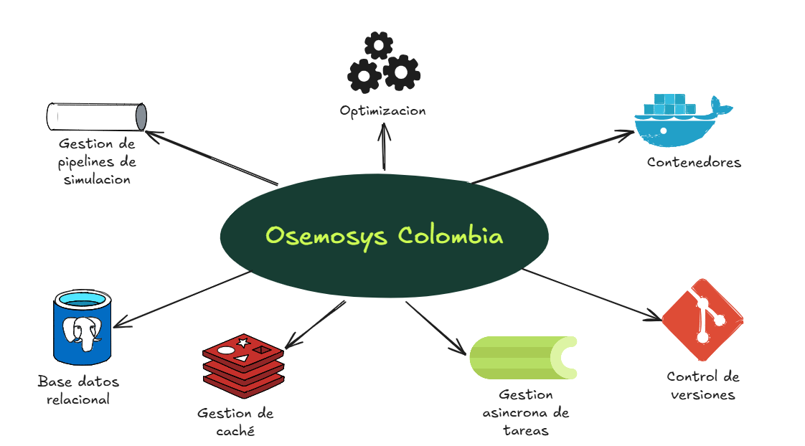

A alto nivel, OSeMOSYS Colombia es el modelo energético en el centro, rodeado de piezas que lo hacen funcionar en equipo incluyendo gestión de pipelines de simulación, un motor de optimización , contenedores para empaquetar y desplegar todo, control de versiones , gestión asíncrona de tareas, gestión de caché y una base de datos relacional.

OSeMOSYS Colombia no es solo "el modelo OSeMOSYS corriendo en algún lado". Es una plataforma que integra ese modelo con un conjunto de herramientas y componentes open source pensados para que el trabajo de modelado escale a un equipo de analistas, no a una sola persona trabajando en su computador.

Un uso típico de OSeMOSYS por sí solo suele verse así. Un analista trabaja localmente con hojas de cálculo o archivos CSV, usa herramientas de línea de comandos (como `otoole`) para preparar los datos, y resuelve el modelo con un solver como GLPK o CBC. Funciona bien para una persona y un caso puntual, pero se vuelve difícil de sostener cuando varios analistas necesitan colaborar, versionar escenarios, correr simulaciones al mismo tiempo, o explorar resultados sin escribir código.

Sobre esa base metodológica, la plataforma agrega varias piezas open source que resuelven justamente esos problemas de escala y colaboración.

Una **base de datos compartida** (PostgreSQL) centraliza los escenarios y catálogos del equipo en un solo lugar, en vez de dejarlos dispersos en archivos locales de cada analista. Una **cola de ejecución** (Celery + Redis) permite que varios analistas lancen simulaciones a la vez, con límites de concurrencia y sin que una corrida pesada bloquee a las demás. Una **interfaz web** (React) traduce la exploración y comparación de resultados en gráficas interactivas, sin necesidad de programar. Y una capa de **solvers intercambiables** (HiGHS de código abierto por defecto, con Gurobi, CPLEX o Mosek como opciones comerciales) se conecta al modelo a través de Pyomo, de forma que elegir solver es una decisión de configuración, no una reescritura del modelo.

Todo esto se empaqueta con Docker, así que el stack completo (base de datos, cola, API, frontend, worker de simulación) se levanta igual en un computador local que en un servidor de producción ignorando el sistema operativo.

## Siguientes pasos

Sigue con [¿Qué es OSeMOSYS?](que-es-osemosys.md) para entender el modelo, y luego con [Instalación](installation.md) para levantar el stack completo.
