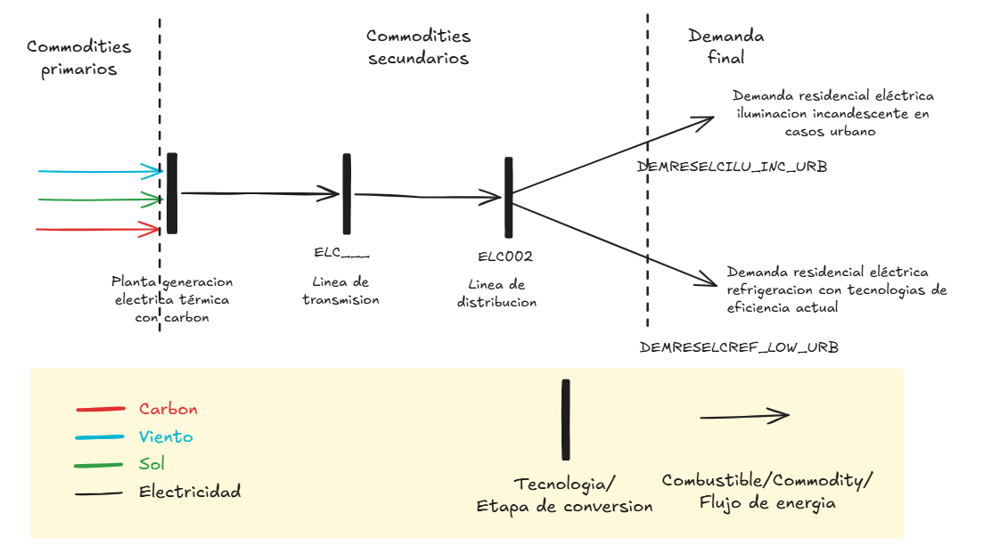

# ¿Qué es OSeMOSYS Colombia?

Antes de instalar nada, vale la pena entender qué hace esta aplicación y de dónde viene el modelo que corre por debajo. Esta página es la introducción conceptual, la primera parada antes de [Instalación](installation.md).

OSeMOSYS Colombia es una plataforma web de planeación energética de largo plazo. Toma un modelo del sistema energético colombiano construido sobre OSeMOSYS (un framework de optimización energética open source) y lo pone al alcance de analistas y planificadores a través de una interfaz web, sin que tengan que escribir código ni operar un solver directamente.

Con ella puedes crear escenarios (distintos supuestos de demanda, tecnología, costos y política), lanzar simulaciones que resuelven un problema de optimización, y explorar los resultados con gráficas interactivas.

Todo modelo de OSeMOSYS, incluido este, representa el sistema energético como una red de **commodities** (combustibles, electricidad, cualquier flujo de energía) y **tecnologías** (procesos que transforman un commodity en otro). A esta red se le llama el **Sistema de Referencia Energético**, o RES por sus siglas en inglés (Reference Energy System).

La energía entra al sistema como **commodities primarios** (recursos como carbón, gas, sol o viento), pasa por una o varias tecnologías de conversión, se convierte en **commodities secundarios** (como electricidad ya transmitida y distribuida), y termina cubriendo la **demanda final** de algún sector (hogares, industria, transporte).

En este diagrama, las flechas de colores son commodities (carbón, viento y sol a la izquierda; electricidad en negro hacia la derecha) y las barras verticales gruesas son tecnologías, los puntos donde un commodity se transforma en otro.

El ejemplo del diagrama sigue la ruta más común del sistema eléctrico colombiano.

1. Tres commodities primarios (carbón, viento, sol) entran a una tecnología de generación. En este caso puntual se ilustra una **planta de generación eléctrica térmica con carbón**, que en el modelo real corresponde al código `PWRCOA`.
2. Esa planta produce electricidad como commodity secundario, representado en el modelo como `ELC`, la electricidad tal como sale de la planta, antes de transmisión.
3. La **línea de transmisión** es otra tecnología, que mueve esa electricidad hasta la siguiente etapa.
4. La **línea de distribución** es la tecnología que finalmente entrega la electricidad a los usuarios. A la salida de esta etapa el commodity cambia de código a `ELC002`, la electricidad ya distribuida, con sus propias pérdidas y costos asociados.
5. Desde ahí, la electricidad distribuida cubre la **demanda final** de dos usos residenciales concretos, `DEMRESELCILU_INC_URB` (iluminación incandescente en hogares urbanos) y `DEMRESELCREF_LOW_URB` (refrigeración con tecnología de eficiencia actual, hogares urbanos).

## Por qué importa entender esto antes de desplegar o correr simulaciones?

Toda la interfaz de la aplicación (escenarios, catálogos, resultados) gira alrededor de estos mismos conceptos, commodities y tecnologías. Cuando más adelante veas nombres como `PWRNGS_CC` (una central de ciclo combinado a gas) o `DEMTRAELCLDV` (demanda de transporte, vehículos livianos eléctricos), ya sabrás que son piezas de este mismo tipo de red, algo que produce o consume un commodity, en algún punto de la cadena entre el recurso primario y el usuario final.