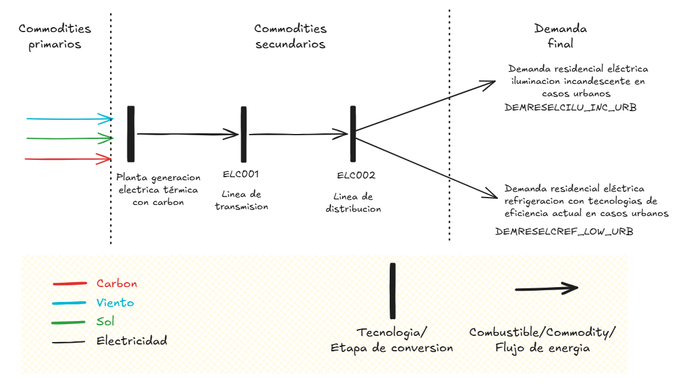

# ¿Qué es OSeMOSYS?

La página anterior explicó [qué es esta plataforma](plataforma.md). Esta explica el modelo que corre por debajo, OSeMOSYS, la metodología de optimización energética en la que se apoya toda la aplicación.

OSeMOSYS (Open Source Energy Modelling System) es un framework abierto de optimización energética, pensado para construir modelos de largo plazo de sistemas energéticos completos. Nació como una alternativa de código abierto a otras herramientas de planeación energética y hoy lo mantiene una comunidad internacional de practicantes e instituciones. La documentación oficial vive en [osemosys.readthedocs.io](https://osemosys.readthedocs.io/) y el código fuente en [github.com/OSeMOSYS](https://github.com/OSeMOSYS).

## Propósito

OSeMOSYS se diseñó para eliminar las barreras de entrada típicas del modelado energético: costo de licencia, curva de aprendizaje pronunciada y dependencia de herramientas propietarias. Su objetivo declarado es servir como herramienta de evaluación integrada de largo plazo y planeación energética que cualquier organización, desde un país hasta una comunidad local, pueda usar sin inversión financiera previa.

Tres principios guían esa apuesta:

- **Accesibilidad.** Sin costo de licencia, con una curva de aprendizaje pensada para que la operen analistas, no solo programadores.
- **Transparencia.** Al ser código abierto, cualquier supuesto o ecuación del modelo puede auditarse, lo que lo hace apto tanto para producir resultados como para formar equipos técnicos y sustentar decisiones ante quienes no construyeron el modelo.
- **Flexibilidad.** El mismo framework se ha usado para modelar sistemas energéticos nacionales, regionales y locales, de uno o varios países, con distintos niveles de desagregación sectorial.

OSeMOSYS Colombia hereda estos tres principios y les agrega la capa colaborativa descrita en [¿Qué es esta plataforma?](plataforma.md).

!!! note "Un modelo aplicado, no el framework genérico"
    Esta página explica los conceptos de OSeMOSYS tal como se usan en el modelo colombiano de esta plataforma. Para la formulación matemática canónica y la documentación exhaustiva del framework, la referencia es la documentación oficial enlazada arriba.

Todo modelo de OSeMOSYS, incluido este, representa el sistema energético como una red de **commodities** (combustibles, electricidad, cualquier flujo de energía) y **tecnologías** (procesos que transforman un commodity en otro). A esta red se le llama el **Sistema de Referencia Energético**, o RES por sus siglas en inglés (Reference Energy System).

La energía entra al sistema como **commodities primarios** (recursos como carbón, gas, sol o viento), pasa por una o varias tecnologías de conversión, se convierte en **commodities secundarios** (como electricidad ya transmitida y distribuida), y termina cubriendo la **demanda final** de algún sector (hogares, industria, transporte).



En este diagrama, las flechas de colores son commodities (carbón, viento y sol a la izquierda; electricidad en negro hacia la derecha) y las barras verticales gruesas son tecnologías, los puntos donde un commodity se transforma en otro.

El ejemplo del diagrama sigue la ruta más común del sistema eléctrico colombiano.

1. Tres commodities primarios (carbón, viento, sol) entran a una tecnología de generación. En este caso puntual se ilustra una **planta de generación eléctrica térmica con carbón**, que en el modelo real corresponde al código `PWRCOA`.
2. Esa planta produce electricidad como commodity secundario, representado en el modelo como `ELC`, la electricidad tal como sale de la planta, antes de transmisión.
3. La **línea de transmisión** es otra tecnología, que mueve esa electricidad hasta la siguiente etapa.
4. La **línea de distribución** es la tecnología que finalmente entrega la electricidad a los usuarios. A la salida de esta etapa el commodity cambia de código a `ELC002`, la electricidad ya distribuida, con sus propias pérdidas y costos asociados.
5. Desde ahí, la electricidad distribuida cubre la **demanda final** de dos usos residenciales concretos, `DEMRESELCILU_INC_URB` (iluminación incandescente en hogares urbanos) y `DEMRESELCREF_LOW_URB` (refrigeración con tecnología de eficiencia actual, hogares urbanos).

## Por qué importa entender esto antes de desplegar o correr simulaciones?

Toda la interfaz de la aplicación (escenarios, catálogos, resultados) gira alrededor de estos mismos conceptos, commodities y tecnologías. Nombres como `PWRNGS_CC` (una central de ciclo combinado a gas) o `DEMTRAELCLDV` (demanda de transporte, vehículos livianos eléctricos) son piezas de ese mismo tipo de red, algo que produce o consume un commodity en algún punto de la cadena entre el recurso primario y el usuario final.

## Parámetros principales del modelo

Todo el conjunto de datos de un escenario (ver [Escenarios y catálogos](../user-guide/escenarios.md)) corresponde a parámetros definidos por OSeMOSYS sobre la red de commodities y tecnologías descrita arriba. La siguiente tabla resume los más relevantes para interpretar un escenario, con la nomenclatura oficial del framework.

| Parámetro | Descripción | Índices |
|---|---|---|
| `SpecifiedAnnualDemand` | Demanda anual total de un commodity, en un año dado. | región, commodity, año |
| `SpecifiedDemandProfile` | Fracción de la demanda anual que corresponde a cada timeslice. | región, commodity, timeslice, año |
| `AvailabilityFactor` | Fracción máxima del año que una tecnología puede operar. | región, tecnología, año |
| `CapacityFactor` | Capacidad disponible en cada timeslice, como fracción de la capacidad total. | región, tecnología, timeslice, año |
| `InputActivityRatio` | Tasa de consumo de un commodity por unidad de actividad de una tecnología. | región, tecnología, commodity, modo, año |
| `OutputActivityRatio` | Tasa de producción de un commodity por unidad de actividad de una tecnología. | región, tecnología, commodity, modo, año |
| `CapitalCost` | Costo de inversión por unidad de capacidad nueva. | región, tecnología, año |
| `FixedCost` | Costo fijo de operación y mantenimiento, por unidad de capacidad. | región, tecnología, año |
| `VariableCost` | Costo variable de operación, según el modo de operación. | región, tecnología, modo, año |
| `OperationalLife` | Vida útil de una tecnología, en años. | región, tecnología |
| `ResidualCapacity` | Capacidad instalada antes del periodo de modelación que sigue disponible. | región, tecnología, año |
| `TotalAnnualMaxCapacity` / `TotalAnnualMinCapacity` | Límites de capacidad total instalada permitida en un año dado. | región, tecnología, año |
| `EmissionActivityRatio` | Factor de emisión de una tecnología, por unidad de actividad y modo. | región, tecnología, emisión, modo, año |
| `DiscountRate` | Tasa de descuento regional para traer los costos a valor presente. | región |

Estos son los parámetros que se editan al crear o ajustar un escenario en la aplicación (ver [Editar y versionar escenarios](../user-guide/escenarios.md#editar-y-versionar-escenarios)). El listado completo de parámetros, sets y restricciones, con su formulación matemática, está en la [documentación oficial de OSeMOSYS](https://osemosys.readthedocs.io/en/latest/manual/Structure%20of%20OSeMOSYS.html).

## Cómo citar OSeMOSYS

Al usar resultados de OSeMOSYS Colombia en un informe, artículo o presentación, la referencia académica del framework metodológico subyacente es:

> Howells, M., Rogner, H., Strachan, N., Heaps, C., Huntington, H., Kypreos, S., Hughes, A., Silveira, S., DeCarolis, J., Bazillian, M., & Roehrl, A. (2011). OSeMOSYS: The Open Source Energy Modeling System: An introduction to its ethos, structure and development. *Energy Policy*, 39(10), 5850–5870. https://doi.org/10.1016/j.enpol.2011.06.033

```bibtex
@article{howells2011osemosys,
  title   = {{OSeMOSYS}: The Open Source Energy Modeling System: An introduction to its ethos, structure and development},
  author  = {Howells, Mark and Rogner, Holger and Strachan, Neil and Heaps, Charles and Huntington, Hillard and Kypreos, Socrates and Hughes, Alison and Silveira, Semida and DeCarolis, Joe and Bazillian, Morgan and Roehrl, Alexander},
  journal = {Energy Policy},
  volume  = {39},
  number  = {10},
  pages   = {5850--5870},
  year    = {2011},
  doi     = {10.1016/j.enpol.2011.06.033}
}
```

## Siguientes pasos

Ver [Requisitos y solvers](requisitos.md) para lo necesario para usar la plataforma, y luego [Primera simulación](../examples/first-simulation.md) para ver el flujo completo en la interfaz.