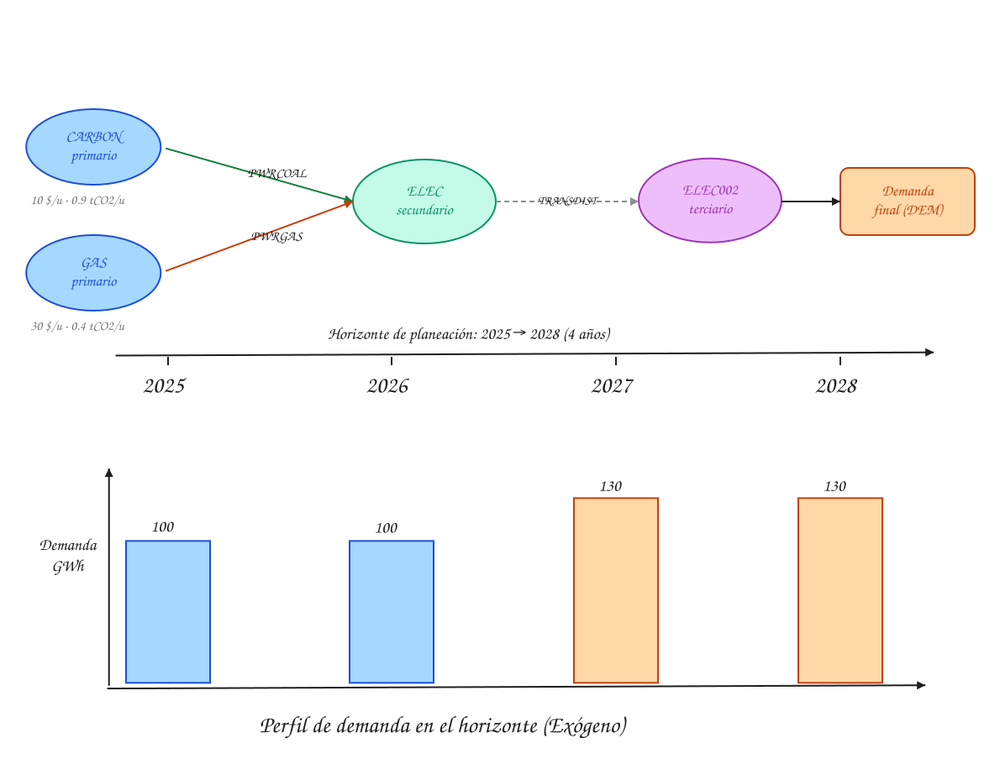
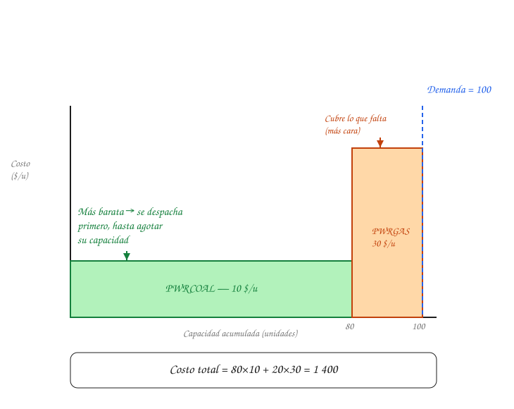

# Quickstart 1 — Despacho económico

Primero de tres recorridos matemáticos, con un sistema mucho más simple que el caso ["Atlantis"](https://osemosys.readthedocs.io/en/latest/manual/Create%20a%20model%20in%20OSeMOSYS.html#the-atlantis-case-study) de la documentación oficial de OSeMOSYS, pero con la misma estructura: unos pocos combustibles importados, unas pocas tecnologías, y una demanda que cubrir. El objetivo es entender explícitamente qué significa "despacho económico" y qué significa "minimizar el costo descontado", con números pequeños que puedes verificar a mano.

!!! warning "Cifras ilustrativas"
    Este sistema y sus números son inventados para que la aritmética sea simple. No son datos del sistema colombiano — para eso, ver los [archivos SAND de referencia](../examples/sand-files.md).

## El sistema

- Región: `R1`.
- Combustibles primarios, 100% importados (como en Atlantis): `CARBON`, `GAS`.
- Commodity de demanda: `ELEC`.
- Tecnologías: `IMPCARBON` e `IMPGAS` (importación), `PWRCOAL` (planta a carbón) y `PWRGAS` (planta a gas), ambas ya instaladas.
- Un solo timeslice (`ANNUAL`), para no mezclar la lógica de despacho con la de franjas horarias.

La vista de arriba incluye una capa adicional de transmisión/distribución (`ELEC` → `ELEC002`) que no aparece en el resto de esta página — se agregó solo para mostrar los cuatro niveles de un RES completo (primario, secundario, terciario, demanda), igual que en el sistema real de OSeMOSYS Colombia, y no cambia ninguno de los cálculos que siguen.

## La restricción de balance

Para cada año, OSeMOSYS exige que la producción de `ELEC` cubra la demanda, y que ninguna tecnología produzca más de lo que su capacidad permite (simplificado aquí, sin franjas horarias):

$$
\text{RateOfProductionByTechnology}[\text{PWRCOAL},y] + \text{RateOfProductionByTechnology}[\text{PWRGAS},y] \geq \text{Demand}[y]
$$

$$
\text{RateOfActivity}[t,y] \leq \text{TotalCapacityAnnual}[t,y] \qquad \text{para cada tecnología } t
$$

## Despacho en 2025

Demanda = 100. Ambas tecnologías ya existen, así que no hace falta invertir todavía (eso viene en el [Quickstart 2](quickstart-2-expansion-capacidad.md)). El modelo minimiza el costo variable total sujeto al balance de arriba: usa primero toda la capacidad de la tecnología más barata, y cubre el resto con la siguiente. Esto es "orden de mérito". En 2026 la demanda es la misma (100), así que el despacho y el costo son idénticos.

## Qué significa "minimizar el costo descontado"

OSeMOSYS no minimiza el costo de un año aislado. Minimiza la suma de los costos de **todos** los años del horizonte, pero **descontados**: un costo dentro de 10 años pesa menos en la suma que el mismo costo el año próximo, porque un dólar hoy vale más que un dólar futuro (es la misma lógica de una tasa de interés, aplicada al revés).

$$
\min \sum_{y} \text{TotalDiscountedCost}[y]
$$

$$
\text{DiscountedOperatingCost}[t,y] = \frac{\text{OperatingCost}[t,y]}{(1 + \text{DiscountRate})^{\,y - y_0 + 0.5}}
$$

El exponente $y - y_0 + 0.5$ mide cuántos años han pasado desde el primer año del horizonte ($y_0$); el $+0.5$ es una convención de OSeMOSYS para tratar el costo operativo como si ocurriera a mitad de año. Con `DiscountRate = 10%` y $y_0 = 2025$:

| Año | $y - y_0 + 0.5$ | Factor de descuento | Costo operativo | Costo descontado |
|---|---|---|---|---|
| 2025 | 0.5 | $\dfrac{1}{1.10^{0.5}} \approx 0.953$ | 1400 | ≈ 1334 |
| 2026 | 1.5 | $\dfrac{1}{1.10^{1.5}} \approx 0.867$ | 1400 | ≈ 1214 |

El mismo costo operativo (1400) pesa distinto según el año: en 2025 casi no se descuenta, en 2026 ya vale un 13% menos en la suma total. Esta es la diferencia entre "minimizar el costo total" y "minimizar el costo descontado": la segunda también decide *cuándo* conviene gastar, no solo *cuánto*. Eso se vuelve decisivo en el siguiente ejemplo, cuando hay que invertir en capacidad nueva.

## Siguiente paso

Continúa con [Quickstart 2 — Expansión de capacidad](quickstart-2-expansion-capacidad.md), donde la demanda de 2027 obliga a invertir en capacidad nueva.
