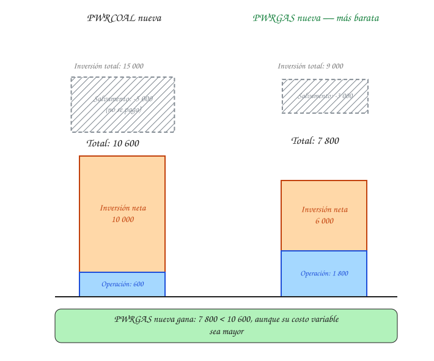

# Quickstart 2 — Expansión de capacidad

Seguimos con el sistema del [Quickstart 1](quickstart-1-oferta-demanda.md) (`PWRCOAL`, `PWRGAS`, demanda creciente 2025-2028). Ahora la demanda supera lo que las plantas ya instaladas pueden cubrir, y el modelo tiene que decidir en qué invertir, cuándo, y cómo se contabiliza esa inversión dentro del costo descontado.

## La pregunta

En 2027 la demanda sube a 130. La capacidad ya instalada es 80 (`PWRCOAL`) + 20 (`PWRGAS`) = 100. Faltan **30 unidades** de capacidad nueva. Hay dos tecnologías candidatas:

| Tecnología nueva | `CapitalCost` | `VariableCost` | `OperationalLife` | `EmissionActivityRatio` |
|---|---|---|---|---|
| `PWRCOAL` nueva | 500 $/unidad | 10 $/unidad | 3 años* | 0.9 t CO₂/unidad |
| `PWRGAS` nueva | 300 $/unidad | 30 $/unidad | 3 años* | 0.4 t CO₂/unidad |

\* En la aplicación real, la vida útil de una planta es de 20-30 años. Aquí se usa 3 años para que la aritmética del horizonte completo (2025-2028) sea verificable a mano.

## Primer criterio: costo total durante la vida útil

La tentación es mirar solo `CapitalCost`, y con eso `PWRGAS` (300) parece obviamente más barata que `PWRCOAL` (500). Pero el modelo compara el costo total de cada opción **durante toda su vida útil**, no solo la inversión inicial. Si cada tecnología operara sus 3 años completos a las 30 unidades nuevas:

- **`PWRCOAL` nueva**: inversión 30×500 = 15 000, más 3 años de operación (30×10 cada año) = 900 → total **15 900**.
- **`PWRGAS` nueva**: inversión 30×300 = 9 000, más 3 años de operación (30×30 cada año) = 2 700 → total **11 700**.

Con solo 3 años de vida útil, la ventaja de costo operativo de `PWRCOAL` (20 $/unidad más barata que `PWRGAS` cada año) no alcanza a compensar su mayor inversión inicial (200 $/unidad más cara). Por eso, con vidas útiles cortas, gana la opción de menor inversión. **En la aplicación real, con 20-30 años de vida útil, la misma diferencia de costo operativo sí alcanza a compensar la inversión inicial — así es como el modelo justifica construir tecnologías con alta inversión pero costo variable bajo o nulo (como una hidroeléctrica o una renovable) en vez de la opción más barata de construir.**

## El detalle que falta: el horizonte de estudio no siempre alcanza a ver toda la vida útil

La cuenta de arriba asume que la tecnología opera sus 3 años completos. Pero se construye en 2027, y el horizonte de este ejercicio termina en 2028 — solo alcanza a ver **2 de los 3 años** de vida útil (2027 y 2028); el tercer año (2029) queda fuera del horizonte modelado.

Si el modelo simplemente descartara ese año sobrante, estaría penalizando la inversión sin razón: esa capacidad sí va a seguir operando después de 2028, solo que ya no dentro de lo que se está estudiando. Para no distorsionar la decisión, OSeMOSYS reconoce esa porción no utilizada como **valor de salvamento** (`DiscountedSalvageValue`): una fracción del costo de inversión, proporcional a los años de vida útil que quedan después del horizonte, se devuelve a la cuenta.

$$
\text{SalvageValue}[t] = \text{CapitalCost}[t] \times \text{NewCapacity}[t] \times \frac{\text{años de vida útil después del horizonte}}{\text{OperationalLife}[t]}
$$

Para ambas tecnologías, 1 de los 3 años de vida útil cae después del horizonte (2029), así que la fracción es 1/3. Con esa corrección, `PWRGAS` nueva sigue siendo la opción más barata, consistente con la comparación de vida útil completa de arriba:

## Aplicando el descuento

Igual que en el Quickstart 1, cada costo se descuenta según el año en que ocurre. La inversión (y su salvamento) se descuentan en el año en que se construye la capacidad ($y - y_0$, sin el ajuste de medio año); la operación usa la misma convención de medio año del Quickstart 1:

| Año | $y - y_0$ | Factor (inversión) | $y - y_0 + 0.5$ | Factor (operación) |
|---|---|---|---|---|
| 2027 | 2 | $\dfrac{1}{1.10^{2}} \approx 0.826$ | 2.5 | $\dfrac{1}{1.10^{2.5}} \approx 0.788$ |
| 2028 | 3 | $\dfrac{1}{1.10^{3}} \approx 0.751$ | 3.5 | $\dfrac{1}{1.10^{3.5}} \approx 0.716$ |

Aplicando estos factores a `PWRGAS` nueva (la opción ganadora, operando 30 unidades/año a 30 $/unidad = 900 $/año):

- Inversión neta descontada: 6 000 × 0.826 ≈ **4 958**.
- Operación 2027 descontada: 900 × 0.788 ≈ 709.
- Operación 2028 descontada: 900 × 0.716 ≈ 645.
- **Total descontado ≈ 6 312.**

Para `PWRCOAL` nueva (inversión neta 10 000, operando 30 unidades/año a 10 $/unidad = 300 $/año): inversión descontada 10 000×0.826 ≈ 8 264, operación 2027 ≈ 300×0.788 ≈ 236, operación 2028 ≈ 300×0.716 ≈ 215 → **total descontado ≈ 8 715**. El descuento no cambia cuál tecnología gana en este caso (`PWRGAS` sigue siendo más barata), pero si las inversiones y los ahorros hubieran caído en años muy distintos, sí podría hacerlo — por eso el descuento importa tanto en la planeación de trayectoria multianual.

## Por qué esto es "planeación de trayectoria" y no una decisión aislada

Nótese lo que **no** tuvo que decidir el modelo: en 2025 y 2026 no hizo falta invertir (la capacidad existente alcanzaba), y en 2027 invirtió exactamente lo necesario (30 unidades), ni antes ni después. Eso es porque OSeMOSYS resuelve **todo el horizonte a la vez**, no año por año de forma aislada: la decisión de cuándo invertir es tan parte del resultado óptimo como en qué invertir, y la capacidad construida en un año sigue contando en todos los años siguientes (vía `OperationalLife`) sin volver a decidirse.

## Siguiente paso

Continúa con [Quickstart 3 — Restricciones de política](quickstart-3-restricciones-politica.md), donde una meta de emisiones cambia la respuesta del Quickstart 1.
