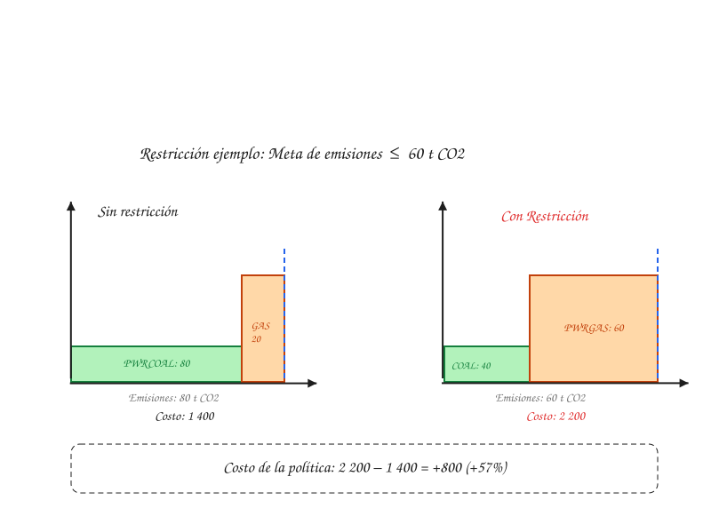

# Quickstart 3 — Restricciones de política

Último de los tres recorridos matemáticos. Retomamos el despacho de 2025 del [Quickstart 1](quickstart-1-oferta-demanda.md) (`PWRCOAL` = 80, `PWRGAS` = 20, costo 1400) y le agregamos una meta de emisiones, para ver explícitamente qué es una restricción de política y cuánto cuesta cumplirla.

## Emisiones del despacho sin restricción

Con los factores de emisión del Quickstart 1 (`PWRCOAL` = 0.9 t CO₂/unidad, `PWRGAS` = 0.4 t CO₂/unidad), el despacho óptimo de 2025 emite:

$$
0.9 \times 80 + 0.4 \times 20 = 72 + 8 = 80 \text{ t CO}_2
$$

## Imponer la meta

Una restricción de política no le dice al modelo qué tecnología usar — le agrega una condición más que la solución tiene que cumplir, además del balance de demanda:

$$
0.9 \times \text{PWRCOAL} + 0.4 \times \text{PWRGAS} \leq \text{AnnualEmissionLimit}
$$

Supón `AnnualEmissionLimit = 60` t CO₂ (una meta más estricta que las 80 t CO₂ que emitía el despacho original). El despacho anterior deja de ser viable (80 > 60), así que el modelo tiene que resolver de nuevo, sujeto a las dos condiciones a la vez: cubrir la demanda (`PWRCOAL + PWRGAS = 100`) y no superar la meta.

Sustituyendo `PWRGAS = 100 − PWRCOAL` en la restricción de emisiones:

$$
\begin{aligned}
0.9 \times \text{PWRCOAL} + 0.4 \times (100 - \text{PWRCOAL}) &\leq 60 \\
0.5 \times \text{PWRCOAL} + 40 &\leq 60 \\
\text{PWRCOAL} &\leq 40
\end{aligned}
$$

## El nuevo despacho

Con `PWRCOAL` en su nuevo máximo (40) y `PWRGAS` cubriendo el resto (60), verifica la meta: $0.9 \times 40 + 0.4 \times 60 = 36 + 24 = 60 \text{ t CO}_2$ (justo en el límite).

## El costo de la política

Esa diferencia frente al despacho sin restricción es, literalmente, "el costo de la política": el sistema no deja de funcionar, solo se vuelve más caro operar dentro de las reglas nuevas. Este es el mismo tipo de número que distingue escenarios reales de política como PD, PA y CN (ver [Evolución de la matriz eléctrica](../examples/matriz-electrica-escenarios.md)), solo que ahí con cientos de tecnologías y datos reales en vez de dos.

!!! note "Cuando la política y el costo apuntan en la misma dirección"
    En el [Quickstart 2](quickstart-2-expansion-capacidad.md), `PWRGAS` ya era la opción más barata para expandir capacidad, y aquí además resulta ser la tecnología que ayuda a cumplir la meta de emisiones. Cuando el costo y la política coinciden, la decisión es sencilla. El caso interesante — y el que realmente pone a prueba al modelo — es cuando compiten entre sí: una tecnología más barata pero más contaminante contra una más cara pero más limpia. Ese es exactamente el tipo de trade-off que resolvió este ejercicio.

## De aquí a la aplicación real

Estos tres quickstarts usan dos tecnologías, un timeslice y cuatro años para que cada cuenta sea verificable a mano. La aplicación real resuelve el mismo tipo de problema — despacho, expansión de capacidad, descuento y restricciones de política — con cientos de tecnologías, más de 30 años de horizonte y varias restricciones a la vez. La lógica de fondo es la misma; ya no se puede verificar a mano, pero ahora sabes qué está pasando por debajo. Para verlo funcionando en la interfaz con datos reales, sigue con [Primera simulación](first-simulation.md).
