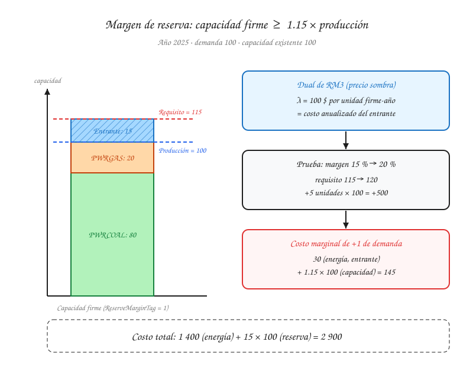

# Quickstart 4 — Margen de reserva y costo del entrante

Recorrido adicional sobre el mismo sistema de los quickstarts anteriores. Hasta ahora el modelo solo tenía que **producir** la energía demandada; aquí además tiene que **tener disponible** más capacidad de la que usa, como respaldo ante fallas o picos imprevistos. Ese requisito es el margen de reserva, y su precio sombra (el dual de la restricción) dice cuánto cuesta cada unidad de respaldo adicional: el **costo del entrante**.

!!! warning "Cifras ilustrativas"
    Igual que en los quickstarts anteriores, los números están elegidos para que la aritmética sea verificable a mano. Para aislar la lógica del margen de reserva se usa un solo año (2025) y un costo de inversión ya anualizado, sin descuento.

## Punto de partida

Se retoma el despacho de 2025 del [Quickstart 1](quickstart-1-oferta-demanda.md):

- Demanda de `ELEC` = 100.
- Capacidad existente: `PWRCOAL` = 80 (10 $/unidad) y `PWRGAS` = 20 (30 $/unidad).
- Despacho óptimo: `PWRCOAL` = 80, `PWRGAS` = 20, costo de energía = 80 × 10 + 20 × 30 = **1 400**.

La capacidad existente (100) alcanza exactamente para la demanda (100). Sin margen de reserva, no hace falta construir nada.

## La restricción de margen de reserva

OSeMOSYS la formula en tres pasos (bloque `RM` del modelo):

$$
\begin{aligned}
\text{TotalCapacityInReserveMargin}[y] &= \sum_{t} \text{TotalCapacityAnnual}[t,y] \times \text{ReserveMarginTagTechnology}[t,y] \\
\text{DemandNeedingReserveMargin}[y] &= \sum_{t} \text{RateOfProduction}[t,\text{ELEC},y] \times \text{ReserveMarginTagFuel}[\text{ELEC},y] \\
\text{DemandNeedingReserveMargin}[y] \times \text{ReserveMargin}[y] &\leq \text{TotalCapacityInReserveMargin}[y] \qquad (\text{RM3})
\end{aligned}
$$

- `ReserveMarginTagTechnology` indica qué fracción de la capacidad de cada tecnología cuenta como capacidad firme. Aquí vale 1 para todas.
- `ReserveMarginTagFuel` indica qué combustibles necesitan reserva. Aquí, solo `ELEC`.
- `ReserveMargin` es el factor exigido. Con `ReserveMargin = 1.15`, el sistema debe tener un 15 % más de capacidad firme que su producción.

Con la producción de 2025 (100), el requisito es:

$$
100 \times 1.15 = 115 \leq 80 + 20 + \text{capacidad nueva}
$$

Faltan **15 unidades** de capacidad firme.

## El entrante

La única forma de cumplir RM3 es construir capacidad nueva. La tecnología candidata es `PWRGAS` nueva del [Quickstart 2](quickstart-2-expansion-capacidad.md) (`CapitalCost` = 300 $/unidad, `OperationalLife` = 3 años). Repartiendo la inversión en partes iguales entre sus 3 años de vida útil, sin descuento, cada unidad cuesta:

$$
\text{Costo anualizado del entrante} = \frac{300}{3} = 100 \ \$ \text{ por unidad firme-año}
$$

Este es el **costo del entrante** (en la literatura, *Cost of New Entry*, CONE): lo que cuesta cada año tener disponible una unidad más de capacidad firme, produzca o no.

El modelo construye exactamente las 15 unidades que faltan, ni una más. El despacho no cambia: `PWRCOAL` y `PWRGAS` existentes siguen cubriendo toda la demanda, porque son más baratas de operar, y el entrante queda como respaldo sin producir.

| Componente | Cálculo | Costo |
|---|---|---|
| Energía (despacho) | 80 × 10 + 20 × 30 | 1 400 |
| Reserva (entrante) | 15 × 100 | 1 500 |
| **Total** | | **2 900** |

## El dual de la restricción

Al resolver el problema, el solver no solo entrega el despacho y la inversión: también entrega un **dual** (precio sombra) por cada restricción. El dual responde a esta pregunta: *si el lado derecho de la restricción se relajara en una unidad, ¿cuánto bajaría el costo total?*

Para RM3, relajar en una unidad significa exigir una unidad menos de capacidad firme (o, lo que es lo mismo, contar con una unidad firme existente adicional). En ese caso el modelo construiría 14 unidades del entrante en vez de 15, y el costo total bajaría en 100. Por lo tanto:

$$
\lambda_{\text{RM3}} = 100 \ \$ \text{ por unidad firme-año} = \text{costo anualizado del entrante}
$$

No es una coincidencia: cuando el margen de reserva está activo y se cubre construyendo capacidad nueva, **el dual de RM3 es el costo de la tecnología que se construye en el margen**.

## Derivación por KKT

El argumento anterior ("relajar en una unidad") es la lectura de sensibilidad del dual. La derivación formal parte del problema primal y de sus condiciones de optimalidad de Karush-Kuhn-Tucker (KKT); en un problema lineal, ambas dan el mismo número.

### El problema primal

Sean $c$, $g$ y $n$ la producción de `PWRCOAL`, `PWRGAS` existente y el entrante, y $K$ la capacidad nueva del entrante, todas $\geq 0$. A la derecha de cada restricción se indica su multiplicador:

$$
\begin{aligned}
\min \quad & 10c + 30g + 30n + 100K \\
\text{s.a.} \quad & c + g + n \geq 100 && (\text{D}) \quad \mu \\
& c \leq 80 && (\text{Cc}) \quad \alpha_c \\
& g \leq 20 && (\text{Cg}) \quad \alpha_g \\
& n \leq K && (\text{Cn}) \quad \alpha_n \\
& 1.15\,(c + g + n) \leq 100 + K && (\text{RM3}) \quad \lambda
\end{aligned}
$$

La producción $c + g + n$ aparece también en RM3, porque OSeMOSYS calcula `DemandNeedingReserveMargin` a partir de `RateOfProduction`. Por eso producir una unidad más también exige más capacidad firme.

La solución óptima es $c = 80$, $g = 20$, $n = 0$, $K = 15$, con costo 2 900.

### Estacionariedad

La derivada del lagrangiano respecto a cada variable debe anularse ($\nu_i \geq 0$ son los multiplicadores de las cotas $x_i \geq 0$):

$$
\begin{aligned}
\partial c: &\quad 10 - \mu + \alpha_c + 1.15\,\lambda - \nu_c = 0 \\
\partial g: &\quad 30 - \mu + \alpha_g + 1.15\,\lambda - \nu_g = 0 \\
\partial n: &\quad 30 - \mu + \alpha_n + 1.15\,\lambda - \nu_n = 0 \\
\partial K: &\quad 100 - \alpha_n - \lambda - \nu_K = 0
\end{aligned}
$$

### Holgura complementaria

Un multiplicador solo puede ser distinto de cero si su restricción está activa, y $\nu_i = 0$ si la variable $x_i$ es positiva. Aplicado en orden:

1. $K = 15 > 0 \Rightarrow \nu_K = 0$, así que $\alpha_n + \lambda = 100$.
2. $n = 0 < K = 15$: la restricción Cn tiene holgura, así que $\alpha_n = 0$ y **$\lambda = 100$**.
3. $n = 0 \Rightarrow \nu_n \geq 0$, y de $\partial n$: $\mu = 30 + 1.15 \times 100 - \nu_n \leq 145$.
4. $g = 20 > 0 \Rightarrow \nu_g = 0$, y de $\partial g$: $\mu = 145 + \alpha_g \geq 145$.
5. De 3 y 4: **$\mu = 145$**, con $\alpha_g = 0$ y $\nu_n = 0$.
6. $c = 80 > 0 \Rightarrow \nu_c = 0$, y de $\partial c$: **$\alpha_c = 145 - 10 - 115 = 20$**.

### Lectura de los multiplicadores

| Multiplicador | Valor | Qué dice |
|---|---|---|
| $\lambda$ (RM3) | 100 | La ecuación $\partial K$ da $\lambda = 100 - \alpha_n$. Como el entrante tiene capacidad ociosa ($\alpha_n = 0$), el dual del margen de reserva es exactamente el costo anualizado del entrante. |
| $\mu$ (demanda) | 145 | La ecuación $\partial n$ da $\mu = 30 + 1.15\,\lambda$: costo de energía del entrante más el costo de la capacidad firme que exige cada unidad producida. |
| $\alpha_c$ (capacidad de `PWRCOAL`) | 20 | Renta de escasez del carbón: lo que ahorra cada unidad de carbón frente a la tecnología marginal (30 − 10). |
| $\alpha_g$, $\alpha_n$ | 0 | Ninguna unidad adicional de esas capacidades reduciría el costo. |

### Verificación: dualidad fuerte

El valor de la función objetivo dual debe ser igual al costo óptimo del primal:

$$
100\,\mu - 80\,\alpha_c - 20\,\alpha_g - 100\,\lambda = 14\,500 - 1\,600 - 0 - 10\,000 = 2\,900
$$

Coincide con el primal, así que los multiplicadores son correctos. En la práctica no hace falta derivarlos a mano: el solver (HiGHS por defecto) los entrega junto con la solución. Su signo depende de si la restricción se escribe como $\leq$ o $\geq$ y de la convención de cada solver, así que conviene interpretarlos por su magnitud y por la restricción a la que pertenecen.

## Cómo analizar ese valor

### 1. ¿Está activa la restricción?

| Dual de RM3 | Lectura |
|---|---|
| $\lambda = 0$ | La restricción no está activa: la capacidad existente ya cubre el requisito. Con `ReserveMargin = 0.95`, por ejemplo, el requisito sería 95 < 100 y la meta de reserva no costaría nada. |
| $\lambda$ = costo del entrante | La restricción está activa y se cumple construyendo el entrante más barato. Es el caso de este ejemplo. |
| $\lambda$ > costo del entrante | Otra restricción impide construir el entrante más barato (por ejemplo, un `TotalAnnualMaxCapacity`), y el margen se está cubriendo con una opción más cara. Conviene revisar qué límite lo está impidiendo. |

### 2. Sensibilidad: el costo de endurecer la meta

El dual permite estimar el costo de cambiar la meta sin volver a resolver el modelo. Si el margen sube de 15 % a 20 %, el requisito pasa de 115 a 120 (5 unidades más):

$$
\Delta \text{Costo} \approx \lambda \times \Delta \text{requisito} = 100 \times 5 = 500
$$

Al resolver de nuevo, el modelo construye 20 unidades del entrante y el costo total sube de 2 900 a 3 400, exactamente lo que anticipaba el dual. Esta estimación es válida mientras el entrante siga siendo la tecnología marginal. Si aparece un límite de capacidad o una opción más cara entra en juego, el dual cambia y hay que resolver de nuevo.

### 3. El costo marginal de la demanda tiene dos componentes

Si la demanda sube de 100 a 101, el sistema necesita dos cosas:

- **Energía**: la unidad adicional la produce el entrante, que ya está construido y tiene capacidad ociosa, a su costo variable de 30.
- **Capacidad**: el requisito sube de 115 a 1.15 × 101 = 116.15, es decir, 1.15 unidades firmes más a 100 cada una.

$$
\text{Costo marginal de la demanda} = \underbrace{30}_{\text{energía}} + \underbrace{1.15 \times 100}_{\text{capacidad}} = 145
$$

Esta descomposición es exactamente la condición de estacionariedad $\partial n$ de la [derivación por KKT](#derivacion-por-kkt): $\mu = 30 + 1.15\,\lambda$.

Sin margen de reserva, ese costo marginal sería solo el componente de energía. Con margen de reserva, una parte importante del valor de cada unidad de demanda está en la **capacidad firme** que obliga a mantener, no en la energía que se produce. En un mercado eléctrico, esta es la lógica que justifica remunerar la capacidad firme por separado de la energía. En Colombia, el Cargo por Confiabilidad cumple ese papel.

!!! note "En el modelo completo"
    En la aplicación real hay un dual de RM3 por región y por año, y está expresado en **valor presente**, porque la función objetivo minimiza el costo descontado (ver el [Quickstart 1](quickstart-1-oferta-demanda.md)). Para llevarlo a dinero del año $y$, se divide por el factor de descuento de ese año. Además, la inversión no está anualizada: una planta construida en un año cuenta para el margen de todos los años de su vida útil, así que su costo se reparte entre los duales de esos años. La lectura sigue siendo la misma: el dual es el costo de la última unidad de capacidad firme exigida.

!!! question "Por confirmar con el equipo de desarrollo"
    El motor implementa el bloque de margen de reserva (ver [Funcionalidades](../features.md#optimizacion)). No está confirmado si hoy se puede configurar desde la interfaz, ni si los duales de las restricciones se exponen en el explorador de resultados.

## Siguiente paso

Para ver el mismo tipo de problema resuelto en la interfaz con datos reales, continúe con [Primera simulación](../examples/first-simulation.md).
