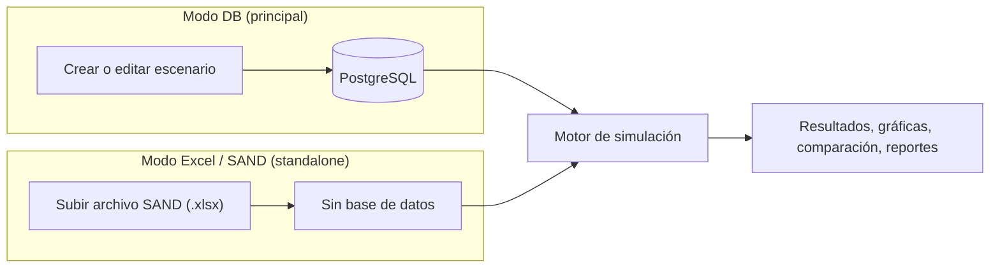

# Visión general

OSeMOSYS Colombia es una aplicación web para planificadores y analistas energéticos que permite ejecutar optimizaciones de un modelo de sistema energético colombiano (basado en OSeMOSYS) y explorar los resultados mediante gráficas interactivas, sin necesidad de escribir código ni operar directamente un solver.

## ¿Qué resuelve la aplicación?

Internamente, cada simulación plantea un problema de optimización lineal (minimización de costos del sistema energético sujeto a restricciones de demanda, capacidad, disponibilidad de recursos, emisiones, etc.) que se resuelve con un solver de programación lineal (HiGHS por defecto; Gurobi, CPLEX o Mosek según la configuración del escenario). Como usuario, no necesitas interactuar con esa capa matemática. La aplicación se encarga de traducir tus datos de entrada y tus decisiones de configuración en un modelo resoluble, y de traducir la solución de vuelta a gráficas y tablas comprensibles.

## Dos modos de trabajo

| Modo | Cómo funciona | Cuándo usarlo |
|------|----------------|----------------|
| **Escenarios en base de datos (modo DB)** | Los datos de entrada (demanda, tecnologías, combustibles, restricciones) viven en la base de datos PostgreSQL de la aplicación, organizados como escenarios reutilizables. | Es el modo principal, para construir, versionar y comparar múltiples escenarios de forma controlada dentro de la plataforma. |
| **Carga de Excel/SAND** | Se sube un archivo Excel con el formato SAND y la simulación corre directamente sobre esos datos, sin pasar por la base de datos. | Para pruebas rápidas, validaciones puntuales, o para reproducir/comparar una corrida hecha originalmente en una hoja de cálculo externa (por ejemplo, un archivo SAND). |

Ambos modos alimentan el mismo motor de simulación y producen resultados visualizables de la misma manera. Ver [Escenarios y catálogos](escenarios.md) y [Carga de datos Excel/SAND](carga-excel-sand.md) respectivamente.



## Flujo general de trabajo

```text
1. Crear o elegir un escenario         →  datos de entrada del sistema energético
2. Simular                             →  el modelo se resuelve en segundo plano
3. Visualizar                          →  explorar resultados con gráficas y tablas
4. Comparar (opcional)                 →  contrastar varios escenarios entre sí
5. Reportar (opcional)                 →  guardar gráficas y ensamblar reportes exportables
```

**Crear escenario.** Define los supuestos del sistema energético que quieres estudiar. Ver [Escenarios y catálogos](escenarios.md).

**Simular.** Lanza la optimización y monitorea su avance. Ver [Simulaciones](simulaciones.md).

**Visualizar.** Explora los resultados con distintos tipos de gráfica, unidades y agrupaciones. Ver [Visualizaciones y reportes](visualizaciones.md).

**Comparar.** Contrasta resultados de varios escenarios simultáneamente (hasta 10) en distintos modos de comparación. Ver [Visualizaciones y reportes](visualizaciones.md#comparacion-entre-escenarios).

**Reportar.** Guarda configuraciones de gráfica como plantillas reutilizables y ensámblalas en reportes exportables. Ver [Visualizaciones y reportes](visualizaciones.md#reportes).

## Funcionalidades adicionales para analistas avanzados

El **diagnóstico de infactibilidad** entra en acción si una simulación no encuentra solución. La aplicación identifica qué restricciones y parámetros están en conflicto. Ver [Simulaciones](simulaciones.md#resultados-infactibles).

El **explorador de datos de resultados** es una vista de tabla de formato ancho con filtrado por múltiples dimensiones (variable, región, tecnología, combustible, emisión, timeslice, modo, almacenamiento) y exportación a Excel.

## Primeros pasos

Si aún no has ejecutado tu primera simulación, sigue el tutorial [Primera simulación](../getting-started/first-simulation.md).

Para detalle técnico/arquitectónico de cómo está construida la aplicación (no necesario para el uso diario), ver [Arquitectura](../architecture/overview.md).
