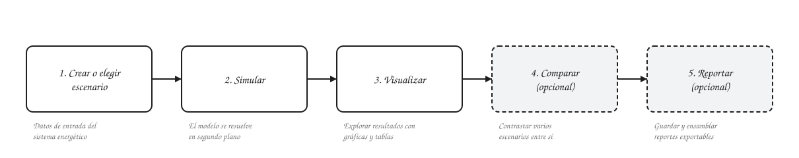

# Visión general

OSeMOSYS Colombia es una aplicación web para planificadores y analistas energéticos que permite ejecutar optimizaciones de un modelo de sistema energético colombiano (basado en OSeMOSYS) y explorar los resultados mediante gráficas interactivas, sin necesidad de escribir código ni operar directamente un solver.

## ¿Qué resuelve la aplicación?

Internamente, cada simulación plantea un problema de optimización lineal (minimización de costos del sistema energético sujeto a restricciones de demanda, capacidad, disponibilidad de recursos, emisiones, etc.) que se resuelve con un solver de programación lineal (HiGHS por defecto; Gurobi, CPLEX o Mosek según la configuración del escenario). Como usuario, no hace falta interactuar con esa capa matemática. La aplicación se encarga de traducir los datos de entrada y las decisiones de configuración en un modelo resoluble, y de traducir la solución de vuelta a gráficas y tablas comprensibles.

## Flujo general de trabajo

**Crear escenario.** Definir los supuestos del sistema energético a estudiar. Ver [Escenarios y catálogos](escenarios.md).

**Simular.** Lanzar la optimización y monitorear su avance. Ver [Simulaciones](simulaciones.md).

**Visualizar.** Explorar los resultados con distintos tipos de gráfica, unidades y agrupaciones. Ver [Visualizaciones y reportes](visualizaciones.md).

**Comparar.** Contrastar resultados de varios escenarios simultáneamente (hasta 10) en distintos modos de comparación. Ver [Visualizaciones y reportes](visualizaciones.md#comparacion-entre-escenarios).

**Reportar.** Guardar configuraciones de gráfica como plantillas reutilizables y ensamblarlas en reportes exportables. Ver [Visualizaciones y reportes](visualizaciones.md#reportes).

## Funcionalidades adicionales para analistas avanzados

El **diagnóstico de infactibilidad** entra en acción si una simulación no encuentra solución. La aplicación identifica qué restricciones y parámetros están en conflicto. Ver [Simulaciones](simulaciones.md#resultados-infactibles).

El **explorador de datos de resultados** es una vista de tabla de formato ancho con filtrado por múltiples dimensiones (variable, región, tecnología, combustible, emisión, timeslice, modo, almacenamiento) y exportación a Excel.

## Primeros pasos

Para quien todavía no ha ejecutado una simulación, ver el tutorial [Primera simulación](../examples/first-simulation.md).
